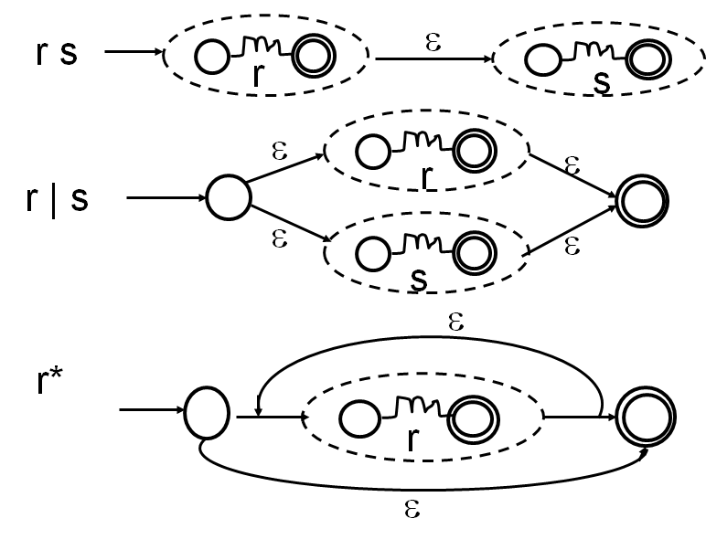
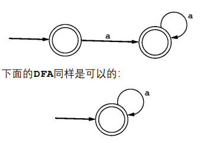
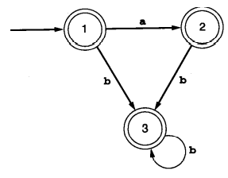
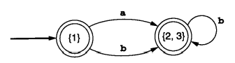
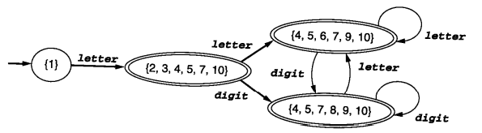
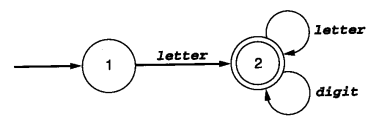

```
[abcd]
[a-z]
[a-z A-Z]
```

用code表示DFA和NFA

1. 纯流程，顺序结构
2. 嵌套，第一层state，第二层input
3. 二维数组表示DFA的transition table

# Regex to DFA

## Thompson's construction(Regex -> NFA)



## the Subset Construction(NFA -> DFA)

中文课本P48

ε闭包

## DFA最小化

### 1



### 2





### 3



