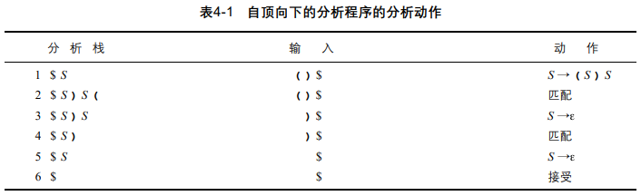

[TOC]

# Top-down parsing

Example



# LL(1) Parsing

> An LL parser is called an LL(*k*) parser if it uses *k* [tokens](https://en.wikipedia.org/wiki/Token_(parser)) of [lookahead](https://en.wikipedia.org/wiki/Parsing#Lookahead) when parsing a sentence. A grammar is called an [LL(*k*) grammar](https://en.wikipedia.org/wiki/LL_grammar) if an LL(*k*) parser can be constructed from it. A formal language is called an LL(*k*) language if it has an LL(*k*) grammar.

目的：用递归的parse可能会遇到回溯的问题，这里用LL构造出可以通过预测确定下一步parse的文法，就可以通过预测的方式规避回溯

Reference: [编译原理语法分析之LL(1) parser - 复制未来 (copyfuture.com)](https://copyfuture.com/blogs-details/20200709094254303w0gyxbowfalywr7)

## LL(1) Parsing Algorithm

**2 kinds of actions**

1. Generate：利用文法选择A→a将栈顶部的非终结符A替换成串a（$是栈底）
    * ==在生成动作中，从 BNF中替换掉的串a必须颠倒地压在栈中（这是因为要保证串a按自左向右的顺序进到栈的顶部）==
2. Match：将栈顶部的记号与下一个输入记号匹配

## Preparation

### Remove Left Recursion

**简单直接左递归**

格式：A -> Aα | β

Sol:

* A -> βA'
* A' -> αA' | ε

**一般的直接左递归**

格式：A -> Aα~1~ | Aα~2~ | ... | Aα~n~ | β~1~ | ... | β~m~

Sol:

* A -> β~1~A' | β~2~A' | ... | β~m~A'
* A' -> α~1~A' | α~2~A' | ... | α~n~A' | ε

Ex.

> exp -> exp + term | exp - term | term
> 如下消除左递归：
> exp -> term exp'
> exp' -> + term exp' | - term exp' | ε （将“+term”和“-term”整个视作α）

**一般的左递归**

```pseudocode
for i = 1 to n:
    for j = 1 to i-1:
        replace each rule of the form A_i -> B_iβ by the rule
            A_i -> α_1 β | α_2 β | ... | α_k β,
            where A_j -> α_1 | α_2 | ... | α_k is the current rule for A_j;
    remove the immediate left recursion involving A_i;
```

### Extract Left Factor

A -> αβ | αγ

改为

A -> αA'
A' -> β | γ

## LL(1) Parsing Table

The general LL(1) Parsing table definition:

* The table is a two-dimensional array indexed by non-terminals and terminals 
* The table contains production choices to use at the appropriate parsing step, which called M[N,T].
    * N is the set of non-terminals of the grammar;
    * T is the set of terminals or tokens (including $);
* Any entrances remaining empty represent potential errors.


The table-constructing rule: 

1. If A→α is a production choice, and there is a derivation α =>\* *a*β, where "*a*" is a token, then add A→ α to the table entry M[A, *a*];
2. If A→α is a production choice, and there are derivations α =>\* ε  and   S\$ =>\* βA*a*γ, where S is the start symbol and "*a*" is a token (or \$), then add A→α to the table entry M[A, *a*];

1. 对于每一条分解开的产生式 A → α 重复步骤2&3

2. 如果a in FIRST(B)，将A → B添加进M[A, a]

3. 如果ε in FIRST(B)，对于FOLLOW(A)中的所有终结符（包括`$`）b，将A → B添加进M\[A, b\]中

4. 所有没有定义的entries都是errors


==注意：需要是在FIRST(α)里的，而不是能被α推导的a都行的==，例如`list -> (lexp-seq)`只能在`M(list, '(')`中


**定理：**<u>若满足以下条件，则BNF中的文法就是LL(1)文法</u>

1. 在每个产生式 A→ a~1~ | a~2~ | ... | a~n~ 中，对于所有的i和j：1≤i, j≤n, i≠j，First(a~i~) ∩ First(a~j~)为空。
2. 若对于每个非终结符A都有First(A)包含了ε，那么First(A) ∩ Follow(A)为空。


==Parser的使用看作业==

## LL(1) Grammar

Definition of LL(1) Grammar:

* <u>A grammar is an LL(1) grammar if the associated LL(1) parsing table has at most one production in each table entry.</u>
* <u>An LL(1) grammar cannot be ambiguous.</u> 

# First & Follow Set

## First(X)

X为一个文法符号（终结或非终结）或ε，则First(X)集合由终结符组成，此外还可能含有ε。

其中

* 若X是终结符==或ε==，则First(X)={X}


**含义**：<u>可以从X推导出的所有串首终结符构成的集合</u>


**不产生ε的情况的算法**

```pseudocode
for all nonterminals A:
    First(A) = {}
while there are changes to any First(A):  /* 其实说的是First(A)中的非终结符的First集合是否有变化 */
    for each production choice A -> X_1 X_2 ... X_n:
        add First(X_1) to First(A)  /* Mention: Only First(X_1) is added */
```

这还蛮简单的

Ex. CNBook P127-4.9


**一般情况，为所有非终结符A计算First(A)的算法**

```pseudocode
for all nonterminals A:
    First(A) = {}
while there are changes to any First(A):
    for each production choice A -> X_1 X_2 ... X_n:
        k = 1; Continue = true;
        while Continue == true and k <= n:
            add First(X_k) - {ε} to First(A)
            if ε not in First(X_k):  /* while到First(X_k)不含ε为止 */
                Continue = false
            k = k + 1
        if Continue == true:  /* First(X_1???)中有ε */
            add ε to First(A)
```

Ex. CNBook P128-4.10

## Follow(A)

给出一个非终结符A，那么集合Follow(A)则是由终结符组成，此外可能还有\$。

集合Follow(A)的定义如下：

1. 若A是开始符号，则\$就在Follow(A)中。
2. 若存在产生式B→αAβ，~~且ε不在First(β)中，~~则First(β)-{ε}在Follow(A)中。
3. 若存在产生式B→αAβ，且ε在First(β)中（β可以推导出空串，<u>包括A是最右符号的情况</u>），则Follow(B)在Follow(A)中。


**含义**：<u>可能在某个句型中紧跟在A后边的终结符a的集合</u>

## LL(k) grammars