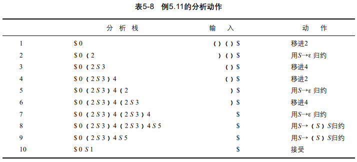
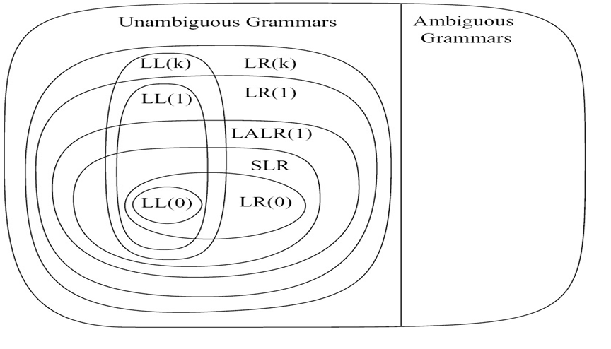

[TOC]

# Overview of Bottom-Up Parsing

## Diff of TD and BU

**TD**: <u>Derive from start symbol</u>

| Stack                |         Input | Actoin               |
| :------------------- | ------------: | -------------------- |
| $ E                  | (a(b(2))(c))$ | E -> L               |
| $ L                  | (a(b(2))(c))$ | L -> (S)             |
| $ ) S (              | (a(b(2))(c))$ | match                |
| $ ) S                |  a(b(2))(c))$ | S -> E S'            |
| $ ) S' E             |  a(b(2))(c))$ | E -> A -> id         |
| $ ) S' id            |  a(b(2))(c))$ | match                |
| $ ) S'               |   (b(2))(c))$ | S' -> E S' -> (S) S' |
| $ ) S' ) S (         |   (b(2))(c))$ | match                |
| $ ) S' ) S           |    b(2))(c))$ | S -> E S' -> id S'   |
| $ ) S' ) S' id       |    b(2))(c))$ | match                |
| $ ) S' ) S'          |     (2))(c))$ | S' 0> E S' -> (S) S' |
| $ ) S' ) S' ) S (    |     (2))(c))$ | match                |
| $ ) S' ) S' ) S      |      2))(c))$ | S -> E S' -> num S'  |
| $ ) S' ) S' ) S' num |      2))(c))$ | match                |
| $ ) S' ) S' ) S'     |       ))(c))$ | S' -> ε              |
| $ ) S' ) S' )        |       ))(c))$ | match                |
| $ ) S' ) S'          |        )(c))$ | S' -> ε              |
| $ ) S' )             |        )(c))$ | match                |
| $ ) S'               |         (c))$ | S' -> E S' -> (S) S' |
| $ ) S' ) S (         |         (c))$ | match                |
| $ ) S' ) S           |          c))$ | S -> A -> id         |
| $ ) S' ) id          |          c))$ | match                |
| $ ) S' )             |           ))$ | match                |
| $ ) S'               |            )$ | S' -> ε              |
| $ )                  |            )$ | match                |
| $                    |             $ | accept               |

**BU**: <u>Derive to start symbol</u>

| Stack               |           Input | Action             |
| ------------------- | --------------: | ------------------ |
| $ 0                 | int x , y , z $ | s3                 |
| $ 0 int 3           |     x , y , z $ | r(T->int), goto 2  |
| $ 0 T 2             |     x , y , z $ | s6                 |
| $ 0 T 2 x 6         |       , y , z $ | r(V->id), goto 5   |
| $ 0 T 2 V 5         |       , y , z $ | s7                 |
| $ 0 T 2 V 5 , 7     |         y , z $ | s8                 |
| $ 0 T 2 V 5 , 7 y 8 |           , z $ | r(V->V,id), goto 5 |
| $ 0 T 2 V 5         |           , z $ | s7                 |
| $ 0 T 2 V 5 , 7     |             z $ | s8                 |
| $ 0 T 2 V 5 , 7 z 8 |               $ | r(V->V,id), goto 5 |
| $ 0 T 2 V 5         |               $ | r(D->TV), goto 1   |
| $ 0 D 1             |               $ | accept             |

## Concept

**2 Kinds of Actions**

1. BShift：将终结符从输入的开头移进到分析栈的顶部。（$表示栈底）
2. Reduce：假设有BNF选择A→a，将栈顶部的串a归约为非终结符A。


**Right sentential form**

用于reduce的，终结符和非终结符的中间串（都叫右句型），如S'=>S=>(S)=>S(S)=>()和E'=>E=>E+n=>n+n的中间串


**viable prefix**

分析栈的符号序列被称作右句型的可行前缀（？

E、E+和E+n都是右句型E+n的可行前缀，但右句子格式n+n却使ε和n作为它的可行前缀(表5-2的第1步和第2步)。请注意，n+不是n+n的可行前缀。

感觉像是右句型的所有前缀中在分析栈中出现过的那些。


**handle**

移进-归约分析程序将终结符从输入移进到栈直到它能执行一个归约以得到下一个右句子格式。它发生在位于栈顶部的符号串匹配用于下一个归约的产生式的右边（箭头右边）。这个串、它在右句子格式中发生的位置以及用来归约它的产生式被称作<u>右句型的句柄</u>(handle)。

例如，在右句子格式n+n中，它的句柄是由最左边的单个记号n与用来归约它以产生新的右句型E+n的产生式E→n组成的串。这个新句型（E+n）的句柄是整个串E+n(一个可行的前缀)以及产生式E→E+n。有时由于表示法上的弊端，我们要用串本身来作为句柄。

如果文法有二义性，那么由此就会存在多于一个的推导，则在右句型中就会有多于一个的句柄。如果文法没有二义性，则句柄就是唯一的。

Determining the next handle in a parse is the main task of a shift-reduce parser.

# FA of LR(0) items and LR(0) Parsing

## LR(0) items

上下文无关文法的LR(0)项(LR(0) item)(或简写为项(item))是在其右边带有区分位置的产生式选择。我们可用一个句点(当然它就变成了元符号，而不会与真正的记号相混淆)来指出这个区分的位置。

所以若A→α是产生式选择，且若β和γ是符号的任何两个串（包括空串），且存在着βγ=α，那么A→β.γ就是LR(0)项。

**Ex.1** S' → S; S → (S)S | ε存在3个产生式和8个项目：

S'→.S
S'→S.
S→.(S)S
S→(.S)S
S→(S.)S
S→(S).S
S→(S)S.
S→.

**Ex.2** E'->E; E->E+n | n 存在8个项目：

E'→.E
E'→E.
E→.E+n
E→E.+n
E→E+.n
E→E+n.
E→.n
E→n.

## FA of items

X可以是**一个(?)**记号或非终结符


* 若X是个symbol，那该转换于X的一个再分析中输入栈顶的shift相对应；
* 若X是个Non-terminal，那由于X永远不会作为输入出现，所以对于每个项目A→α.Xη，必须为X的每个产生式X→β添加一个ε产生式：
    * 

NFA Example：

* DFA的开始状态是由项目S'→.S组成的集合的ε-闭包


### NFA -> DFA

使用Subset Construction


## ==LR(0) Parsing Algorithm==

LR(0)分析算法(LR(0) parsing algorithm)。令s为当前的状态(位于分析栈的顶部)。则动作定义如下：

1. 若状态s包含了格式A→a.Xb的任何项目，其中X是一个终结符，则动作就是将当前的输入记号移进到栈中。若这个记号是X，且状态s包含了项目A→a.Xb，则压入到栈中的新状态就是包含了项目A→aX.b的状态。若由于位于刚才所描述的格式的状态s中的某个项目，这个记号不是X，则声明一个错误。
2. 若状态s包含了任何完整的项目(格式A→a.的一个项目)，则动作是用规则A→a归约。假设输入为空，用规则S'→S归约(其中S是开始状态)与接受相等价；若输入不为空，则出现错误。在所有的其他情况中，新状态的计算如下：将串a及它的所有对应状态从分析栈中删去（根据DFA的构造方式，串a必须位于栈的顶部）。相应地，在DFA中返回到由a开始构造的状态中（这须是由a的删除所揭示的状态）。由于构造DFA，这个状态就还须包含格式B→a.Ab的一个项目。将A压入到栈中，并压入包含了项目B→aA.b的状态（作为新状态）。（请注意，由于正将A压入到栈中，所以这与在DFA中跟随A的转换相对应(这实际上是合理的)。

**Example**

A -> **(** A **)** | **a**


* 数字表示状态，根据<u>当前状态（栈顶）</u>和<u>从输入处移入（Shift）的X</u>进行转移

|      | 分析栈              |        输入 | 动作       |
| ---- | ------------------- | ----------: | ---------- |
| 1    | $ 0                 | ( ( a ) ) $ | Shift      |
| 2    | $ 0 ( 3             |   ( a ) ) $ | Shift      |
| 3    | $ 0 ( 3 ( 3         |     a ) ) $ | Shift      |
| 4    | $ 0 ( 3 ( 3 a 2     |       ) ) $ | A -> a     |
| 5    | $ 0 ( 3 ( 3 A 4     |       ) ) $ | Shift      |
| 6    | $ 0 ( 3 ( 3 A 4 ) 5 |         ) $ | A -> ( A ) |
| 7    | $ 0 ( 3 A 4         |         ) $ | Shift      |
| 8    | $ 0 ( 3 A 3 ) 5     |           $ | A -> ( A ) |
| 9    | $ 0 A 1             |           $ | Accept     |

# SLR(1) Parsing

## SLR(1) Def

简单LR(1)分析，或SLR(1)分析，也如上一节中一样使用了LR(0)项目集合的DFA。但是，通过使用输入串中下一个记号来指导它的动作。

定义：SLR(1)分析算法(SLR(1) parsing algorithm)。令s为当前状态(位于分析栈的顶部)。则动作可定义如下：

1. shift：若状态s包含了格式A→α.Xβ的任意项目，其中X 是一个终结符，且X是输入串中的下一个记号，则动作将当前的输入记号移进到栈中，且被压入到栈中的新状态是包含了项目A→αX.β的状态。
2. reduce：若状态s包含了完整项目A→γ.，则输入串中的下一个记号是在Follow(A)中，所以动作是用规则A→γ归约。只有当下一个输入记号是$时，用规则S'→S归约才与接受等价（其中S是开始状态）。在所有的其他情况中，新状态都是如下计算的：删除串α和所有它的来自分析栈中的对应状态。相对应地，DFA回到α开始构造的状态。通过构造，这个状态必须包括格式B→γ.Aβ的一个项目。将A压入到栈中，并将包含了项目B→αA.β的状态压入。
3. 若下一个输入记号都不是上面两种情况所提到的，则声明一个错误。


若上述的SLR(1)分析规则并不导致二义性，则文法为SLR(1)文法(SLR(1) grammar)。特别地，当且仅当对于任何状态s，以下的两个条件：

1. ==对于在s中的任何项目A→α.Xβ（shift reading X），当X是一个终结符，且X在Follow(B)中时，s中没有完整的项目B→γ.（reduce）。==
2. ==对于在s中的任何两个完整项目A→α.和B→β.，Follow(A) ∩ Follow(B)为空。==

均满足时，文法为SLR(1)。~（这两个条件同前一章中所述的LL(1)分析的两个条件在本质上是类似的~

<u>若第1个条件不满足，就表示这是一个移进-归约冲突(shift-reduce conflict)。若第2个条件不满足，就表示这是一个归约-归约冲突(reduce-reduce conflict)。</u>


## SLR(1) Example


Using SLR(1) Parsing Table to parse "()()":



# General LR(1) and LALR(1) Parsing

## FA of LR(1) items

SLR(1)中的困难在于它在LR(0)项的DFA的构造之后提供先行，而构造却又忽略了先行。

LR(1)项应是由LR(0)项和一个先行记号组成的对。利用中括号将LR(1)项写作[A→α.β, a]。其中A→α.β是一个LR(0)项，而a则是一个记号(先行记号，lookahead token)。

**Def**

* 假设有LR(1)项目[A→α.Xγ, **a**]，其中X是任意符号(终结符或非终结符)，那么X就有一个到项目[A→αX.γ, **a**]的转换。
    * ==并不会创造新先行==
* 假设有LR(1)项目[A→α.Bγ, a]，其中B是一个非终结符，那么对于每个产生式B→β和在First(γa)中的每个记号b都有到项目[B→.β, b]的ε-转换。
    * ==ε-转换会创造新的先行==
    * 项目[A→α.Bγ, a]说明了在分析的这一点上可能要识别B，但这只有是当这个B后跟有一个从串γa派生出的串时，且这样的串须以一个在First(γa)中的记号开始才可能。

### Getting Lookahead

Supplement Material: [parsing - LR(1) Item DFA - Computing Lookaheads - Stack Overflow](https://stackoverflow.com/questions/14103199/lr1-item-dfa-computing-lookaheads)

* 来自其他闭包：继承
* 来自同一闭包(ε-trans)：使用derived的First(γa)来创造新的先行

```c
S -> AB
A -> aAb | a
B -> d

[0] S’ -> .S ($)  // DON'T FORGET THIS
S -> .AB  ($)
A -> .aAb (d)  // First(B$)
A -> .a   (d)  // First(B$)

[1]            // From 0: a
A -> a.Ab (d)  // From line 7
A -> a.   (d)  // From line 8
A -> .aAb (b)  // First(bd), From line 11
A -> .a   (b)  // First(bd), From line 11

[2]            // From 1: a; From 2: a
A -> a.Ab (b)  // From line 13
A -> a.   (b)  // From line 14
A -> .aAb (b)  // First(bb), From line 17
A -> .a   (b)  // First(bb), From line 17

[3]            // From 1: A
A -> aA.b (d)  // From line 11

[4]            // From 3: b
A -> aAb. (d)  // From line 23

[5]            // From 0: A
S -> A.B  ($)  // From line 6
B -> .d   ($)  // First($$), From line 29

[6]            // From 5: d
B -> d.   ($)  // From line 30

[7]            // From 5: B
S -> AB.  ($)  // From line 29

[8]            // From 2: A
A -> aA.b (b)  // From line 17

[9]            // From 8: b
A -> aAb. (b)  // From line 39

[10]           // From 0: S
S’ -> S.  ($)  // From line 5
```


### NFA -> DFA

* start symbol: `[S' -> .S, $]`


**Another Example**. A -> **(** A **)** | **a**


## LR(1) Parsing Algorithm

### ==LR(1) Parsing Table==

==和SLR(1)的区别？区别在于归约的时候如果没有next-state，entry就要采用lookahead作为input，而SLR(1)中统一都是\$（例如下面6的r2）==


where reduce rule1: A->(A); rule2: A->a

### LR(1) Grammar

当且仅当对于任何状态s，能够满足以下两个条件，该文法才是LR(1)文法：

* 对于在s中的任何项目[A→α.Xβ,a]（用X的移位），且X是一个终结符，则在s中**没有**格式[B→β.,X]（如果有就会有一个B->β的归约）的项目(否则就有一个移进-归约冲突)。
* 在s中没有格式[A→α.,a]和[B→β.,a]的两个项目(否则就有一个归约-归约冲突)。

以上两个冲突表现在parsing table均是一个entry有多个items

## LALR(1) Parsing

**Look Ahead LR**：LR(1)虽然好，但是DFA太臃肿了，LALR(1)会合并LR(1)中具有完全相同的LR(0) items（即LR(1) item - lookahead）的状态们。


LALR(1) items: [LR(0) items, la~0~ / la~1~ / ... / la~n~]


若一个文法是LR(1)文法，则LALR(1)分析表就不能有任何的shift-reduce冲突了；但是却有可能有reduce-reduce冲突。

然而，若一个文法是SLR(1)，那么它肯定就是LALR(1)文法，而且LALR(1)分析程序在消除发生在SLR(1)分析中的典型冲突时通常与一般的LR(1)分析程序所做的相同。

## Hierarchy of Grammar Classes



# YACC: LALR(1) Generator