[TOC]

> **Intro**
>
> 语义分析

# Attributes and Attribute Grammars

## Basic Concepts

属性(**attribute**)是编程语言结构的任意特性。典型例子有：
* 变量的数据类型。
* 表达式的值。
* 存储器中变量的位置。
* 程序的目标代码。
* 数的有效位数。

<u>Attributes may be fixed prior to the compilation process or may be only determinable during program execution.</u>

---

* **Binding** of the attribute: the process of computing an attribute and associating its computed value with the language construct in question.
* **Binding time**: the time during the compilation/execution process when the binding of an attribute occurs.
    * 在执行之前联编的属性称作静态的(static)，而只在执行期间联编的属性是动态的(dynamic)。对于编译程序编写者而言，当然对那些在翻译时联编的动态属性感兴趣。

---

* A **type checker**: is an important part of semantic analysis (in a language like C or Pascal)
* A type checker is a analyzer(语义分析<u>程序</u>)
    * 计算定义数据类型的所有语言实体的数据类型属性，并验证这些类型符合语言的类型规则。
* **Type checking**: set of rules that ensure the type consistency of different constructs in the program

## Attribute Grammars

**syntax-directed semantics**(语法制导语义): attributes are associated directly with the grammar symbols of the language.

* Denotation: *X.a*: the value of a associated to X, where *X* is a grammar symbol and *a* is an attribute associated to *X*. （a是属性名不是属性值，X.a才是属性值）

若有一个属性的集合a~1~, ..., a~k~，语法制导语义的原理应用于每个文法规则X~0~ → X~1~X2...X~n~(这里X~0~是一个非终结符号，其他的X~i~都是任意符号)，每个文法符号X~i~的属性X~i~.a~j~的值与规则中其他符号的属性值有关。如果同一个符号X~i~在文法规则中出现不止一次，那么每次必须用合适的下标与在其他地方出现的符号区分开来。每个关系用属性等式(attribute equation)或语义规则(semantics rule)表示，形式如下：<br />X~i~.a~j~=f~ij~(X~0~.a~1~, ..., X~0~.a~k~，X~1~.a~1~, ..., X~1~.a~k~, ..., X~n~.a~1~, ..., X~n~.a~k~)<br />这里的f~ij~是一个数学函数。属性a~1~, ..., a~k~的属性文法(attribute grammar)是对语言的所有文法规则的所有这类等式的集合。


一般地，将属性文法写成表格形式，每个文法规则用属性等式的集合或者相应规则的语义规则列出，如下所示：

| Grammar Rule                                                 | Semantic Rules                                               |
| ------------------------------------------------------------ | ------------------------------------------------------------ |
| decl → var-list : type<br />var-list~1~ → var-list~2~, **id**<br /><br />var-list → **id**<br />type → **integer**<br />type → **real** | var-list.dtype = type.dtype<br />id.dtype = var-list~1~.dtype<br />var-list~2~.dtype = var-list~1~.dtype<br />id.dtype = var-list.dtype<br />type.dtype = integer<br />type.dtype = real |


**另一例**

```
number -> number digit | digit
digit -> 0 | 1 | 2 | 3 | 4 | 5 | 6 | 7 | 8 | 9
```

将digit的“值”命名为val。

* 考虑规则number -> digit，属性等式为number.val = digit.val
* 考虑规则number -> number digit，首先要区分两个number，将文法重写为number~1~ -> number~2~ digit，然后属性等式是number~1~.val = number~2~.val \* 10 + digit.val

属性文法表为：

| 文法规则                     | 语义规则                                       |
| ---------------------------- | ---------------------------------------------- |
| number~1~ -> number~2~ digit | number~1~.val = number~2~.val \* 10 + digit.va |
| number > digit               | number.val = digit.val                         |
| digit -> **0**               | digit.val = 0                                  |
| ...                          | ...                                            |
| digit -> **9**               | digit.val = 9                                  |

<u>\* 加粗与不加粗：文法中加粗表示这是一个symbol，而digital.val = x中不加粗表示这个digit(数字)的val(数值)为0</u>


**续例**

加入了进制的表示，basechar -> **o** | **d**，则需要给num和digit加入新的属性base，并需要对八进制下的**8**和**9**引入error值，然后引入if-then-else表达式。

* 文法digit -> 8的语义规则是digital.val = **if** digit.base = 8 **then** error **else** 8
* 文法num~1~ -> num~2~ digit的语义规则为num~1~.val = **if** digit.val=error **or** num~2~.val=error **then** error **else** num~2~.val \* num1.base + digit.val

## Simplifications and Extensions to Attribute Grammars

# Algorithms for Attribute Computation

## dependency graph

**associated dependency graph**(也叫dependency graph)

* 针对<u>给定semantic</u> rule 的 grammar rule
    * number~1~.val = number~2~.val \* 10 + digit.val：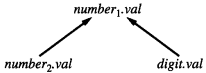
* 针对string
    * **345**：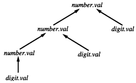

---

**dependency graph superimposed over a parse tree segment corresponding to the grammar rule**

例如decl -> type var-list的语义规则是var-list.dtype = type.dtype（不包括了decl），所以相关图要画成：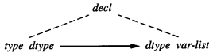（虚线连在symbol上)

注意：在画语法树节点时我们禁止使用属性的圆点符号，而是通过写出与其相连的下一个节点来表示属性。

类似的，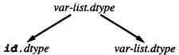可以画成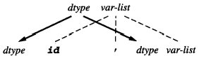

**float x, y**的相关图是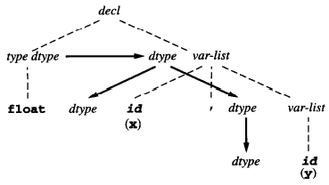

---

**topological sort & DAG**(directed acyclic graphs)

任一个算法在试图计算任何后继节点的属性之前，必须计算相关图中每个节点的属性。这样的遍历就是拓扑排序。有拓扑排序的充要条件是这个图是非循环的，称这种图形为DAG。

**345o**的依赖图：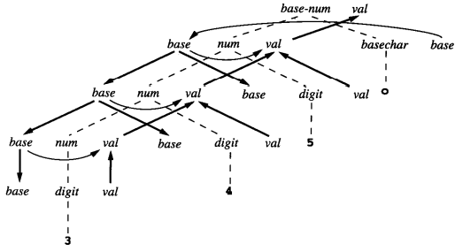

删除语法树：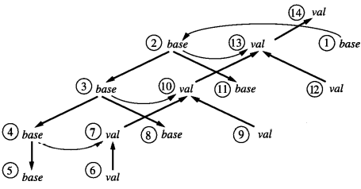（便于观察）

拓扑排序：

* 1 2 3 4 5 6 7 8 9 10 11 12 13 14
* 12 6 9 1 2 11 3 8 4 5 7 10 13 14

## synthesized & inherited

[Differences between Synthesized and Inherited Attributes - GeeksforGeeks](https://www.geeksforgeeks.org/differences-between-synthesized-and-inherited-attributes/)

* synthesized
     * An attribute is synthesized
          * if all its dependencies point from child to parent in the parse tree.
          * given a grammar rule A -> X~1~X~2~…X~n~, the only associated attribute equation with an A.a on the left-hand side is of the form:
          * A.a = f(X~1~.a~1~, …, X~1~.a~k~, …, X~n~.a~1~, …, X~n~.a~k~)
     * S-attributed grammar:
          * An attribute grammar in which all the attributes are synthesized
          * S属性文法的属性值可以通过对树进行后序遍历来计算
          * ```pseudocode
              procedure PostEval(T: treeNode);
              begin
                  for each child C of T do
                      PostEval(C);  // 先遍历
                  compute all synthesized attributes of T;  // 再自己
              end;
              ```
* inherited
     * An attribute that is not synthesized is called an inherited attribute.
     * Type
          * inheritance from parent to siblings: 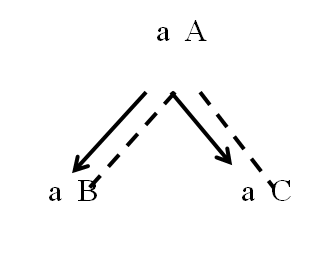
          * inheritance from sibling to sibling: 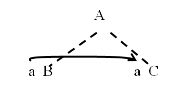
     * 继承属性的计算可以通过前序遍历或前序/中序遍历的组合来进行
          * ```pseudocode
               Procedure PreEval(T: treenode);
               Begin
                   For each child C of T do
                       Compute all inherited attributes of C;
                       PreEval(C);
               End;
               ```

## Attributes as params and ret vals

- 把继承属性作为参数传入
- 把综合属性作为返回值输出

## The use of external data structures to store attributes values

- 通过符号表存储
- 基本的数据结构有`insert`、`lookup`和`delete`

# Symbol Table

Semantic checks refer to properties of identifiers in the program -- their scope or type

* Need an environment to store the information about identifiers = symbol table
* Each entry in the symbol table contains
    * the name of an identifier
    * additional information: its kind, its type, if it is constant, …
    * example of `bool foo(int m, const int n);`
        * | NAME | KIND | TYPE              | ATTR   |
            | ---- | ---- | ----------------- | ------ |
            | foo  | fun  | int x int -> bool | extern |
            | m    | arg  | int               |        |
            | n    | arg  | int               | const  |
            | tmp  | var  | bool              | const  |


## Structure of the symbol table

### Linear List

* insert: O(1)
* lookup & delete: O(N)

### Search Tree

BST, AVL, B

### Hash Table

O(1)

**Main problem**: collision: two keys are mapped to the same index by the hash function

* Resolution
    * Open addressing: 放下一个
    * Separate chaining: 链表


Size of hash table: number of buckets must be prime number

## Declarations

Basic kinds

* constant
    * value binding
    * how compiler treat
        * pascal and modula-2: static, computable by the compiler
        * c and Ada: dynamic, computable during execution, buts still cannot change
* type
    * bind name to newly constructed types
    * create aliases for existing named types
* variable
    * bind names to data types
* function


**Strategies**

1. use one symbol table to hold the names from all the different kinds of declarations.
 2. use a different symbol table for each kind of declaration.
 3. associate separate symbol tables with different regions of a program and link them together according to the semantic rules of the language.

## Scope

A language is **block structured** if

* it permits the nesting of blocks inside other blocks
* the scope of declarations in a block are limited to that block and other block contained in that block


```c
int i, j;
int f(int size) {
    char i, temp;
    // ...
    {
        double j;
        // ...
    }
    {
        char *j;
        // ...
    }
}
```


几种symbol table的方式
* 一种Solution（注意：在第几列是hash出来的，而不是仅根据名字
    1. after processing the declarations of the body of f<br />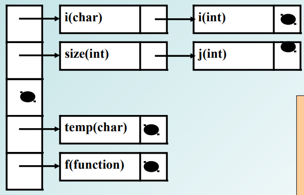
    2. after processing the declarations of the second nested compound statement within the body of f<br />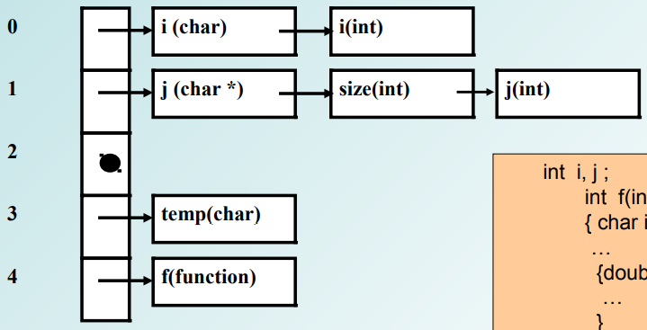
    3. after exiting the body of f (and deleting its declarations)<br />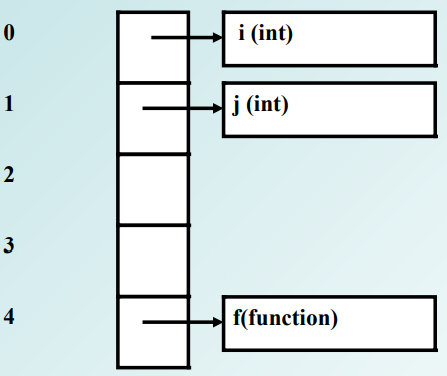
* Another solution: building a new symbol table for each scope and to link the tables from inner to outer scopes together（一个域一个表）<br />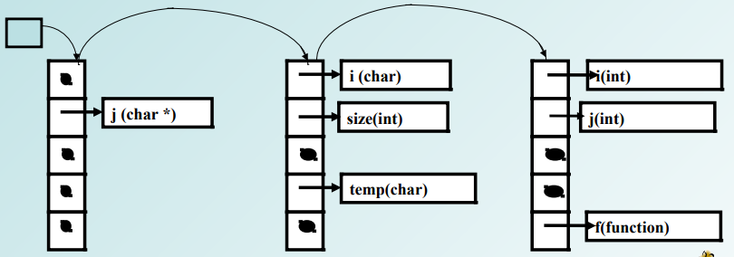

## Same-level declarations

Why?

```c
typdef int i;
int i;  // error
```

How to avoid?

* Lookup before each insert. (to symbol table)


3种处理同scope种声明的方式

* sequential：依次加入符号表
* collateral：先加入一个临时表，然后等所有的decl都处理完再加入符号表
* recursive：decls may refer to themselves or each others

## An extended example of an attribute grammar using a symbol table

# Data Types and Type Checking

**Type checking**: set of rules that ensure the type consistency of different constructs in the program

## Type expressions and type constructors

* Simple Type
    * int
    * double
    * boolean
    * char
    * void
* Structured Type
    * be created using type constructors.
        1. take existing types as parameters.
        2. return new types with a structure that depends on the constructor.
* Array
* Record
    * a record or structure type constructor takes <u>a list of names and associated types</u> and constructs a new type.
    * `struct {double r; int i;}`
* Union
    * disjoint union, each value is viewed as either a real or an integer, but never both.
    * `union {double r; int i;}`
* Pointer
* Function
* Class
    * similar to a record declaration, except <u>it includes the definition of methods</u>

## Type names, type declarations and recursive type

# A semantic analyzer for the TINY language

