[TOC]

# Stack-Based Runtime Env

## SB Env w/o Local Procedures

* Frame pointer or **fp**, a pointer to the current 《==activation record==》 to allow access to local variable.
    * ==control link== or dynamic link, a point to a record of the immediately **preceding** activation.（也称作old fp，因为是fp的旧值）
* Stack pointer or **sp**, a point to the last location allocated on the call stack.（栈顶）


**Example1**

```c
#include <stdio.h>
int x, y;

int gcd(int u, int v) {
    return v == 0 ? u : gcd(v, u % v);
}

int  main() {
    scanf("%d%d", &x, &y);
    printf("%d\n", gcd(x, y));
    return 0;
}
```

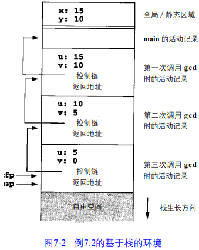

在每个新*活动记录*中，*控制链*指向先前活动记录的*控制链*。还请大家注意，fp指向当前*活动记录*的*控制链*，因此在下一个调用中当前的fp就会变成下一个*活动记录*的*控制链*了。


**Example2**

```c
int x = 2;
void g(int); /*prototype*/

void f(int n) {
    static int x = 1;
    g(n);
    x--;
}
void g(int m) {
    int y = m - 1;
    if (y > 0) {
        f(y);
        x--;
        g(y);
    }
}
int main() {
    g(x);
    return 0;
}
```

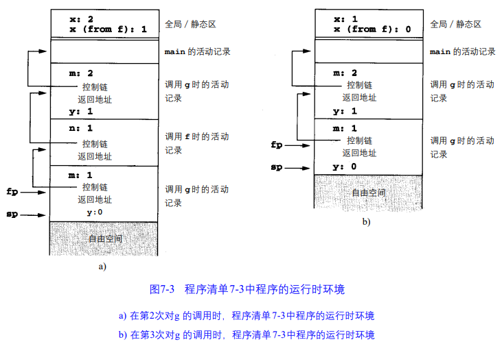

Stack structure:

```
main
main g(2)            // 第一次
main g(2) f(1)
main g(2) f(1) g(0)  // 第二次
main g(2) f(1)
main g(2)
main g(2) g(1)       // 第三次
main
```

**Activation Tree**

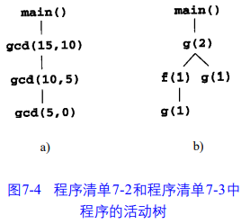

### Details

#### Access to Names

* parameters and local variable must be found <u>by offset from the current fp</u>.
* In most language, the offset can be statically computable by the compiler.

#### Calling Sequence

**enter**:

1. Compute the arguments and store them in their correct positions in the new activation record of the procedure;
2. Store the fp as the control link in the new activation record;（就相当于old fp）
3. Change the fp so that it points to the beginning of the new activation record;（fp := sp）
4. Store the return address in the new activation record;（存RA）
5. Perform a jump to the code of the procedure to be called.（jmp）

**exit**:

1. Copy the fp to the sp.
2. Load the control link into the fp.
3. Perform a jump to the return address.
4. Change the sp to pop the arguments.

#### Dealing with variable-length data

What vary? number of objs / size of each obj


2 examples

* The number of arguments in a call may vary from call to call
    * ex: printf
    * deal: pushing the arguments to a call <u>in reverse order</u> onto the runtime stack
        * The first parameter is always located at a fixed offset from the fp in the implementation described above.
* The size of an array parameter or a local array variable may vary from call to call
    * ex: Ada

#### Local Temporaries and Nested Declarations

**Local temporaries**

* `x[i] = (i + j) * (i / k + f(j))`
    * 3 partial results need to be saved across the call to `f(j)`
        * The address of `x[i]`;
        * The sum `i+j`
        * The quotient `i/k`;
* Deal
    * reg
    * stack
        * 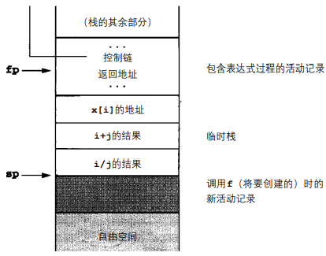

**Nested Decl**

 ```c
 void p(int x, double y) {
     char a;
     int i;

     // ...

     {  // Block A
         double x;
         int j;
         // ...
     }

     // ...

     {  // Block B
         char *a;
         int k;
         // ...
     }

     // ...
 }
 ```

每个块可以视作一个基于上一层的global的局部procedure

* 进入块A：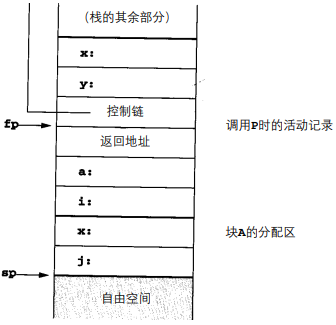
* 进入块B：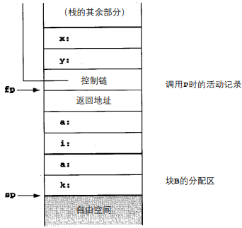

## SB Env with Local Procedures

When local procedure declarations are permitted, there are maybe <u>non-local and non-global</u> reference to var.

Ex.

```pascal
program xx;

procedure p;
var n: integer;

    procedure q;
    begin
        (* a ref to `n` is now non-local and non-global,
           but it should be the p.n *)
    end; (* q end *)

    procedure r(n: integer);
    begin
        q;
    end; (* r end *)

begin
    n := 1;
    r(2);
end; (* p end *)

begin (* main *)
    p;
end;
```

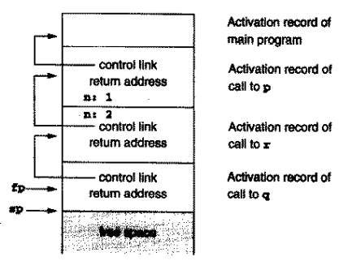

**Sol**. Use Access Link

将一个称作访问链 (==access link==)的额外簿记信息添加到每个活动记录中。除了可以指向代表过程的定义环境而不是调用环境之外，访问链与控制链相似。

* ==Access link== represents the <u>defining environment</u> of the procedure; access link is sometimes also called the static link.
* ==Control link== represents the <u>calling environment</u> of the procedure.

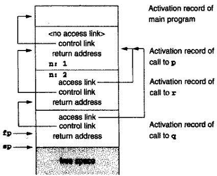

\* p自己没有access link：因为p是个global procedure，所以p中的non-local ref一定是global的

### Details

#### ==Calling Sequence==

调用时将access link压入到fp前的stack，退出时用一个额外的量来修改sp以便删掉access link（？

## SB Env with Procedure Param

将procedure作为param传递（函数指针）时，必须将procedure的access link与procedure code的pointer一同传递。

# Dynamic Memory

Motivation: A stack-based environment will result in a dangling reference.

```c
int *dangle(void) {
    int x;
    return &x;
}
```

```c
#include <stdio.h>

typedef int (*proc)(void);

proc g(int x) {
    int f(void) {  // illegal local function
        return x + 1;
    }
    return f;
}

int main() {
    proc c;
    c = g(2);             // c is a pointer
    printf("%d\n", c());  // should print 3
    return 0;
}
```

## Fully Dynamic Runtime Env

* It can deallocate activation records only when all references to them have disappeared
* garbage collection:
    * the tracking of references during execution.
    * the ability to find and deallocate in accessible areas of memory at arbitrary times during execution. 
* In fully dynamic environment, the basic structure of <u>activation record</u> <u>remains the same</u>.
* When control is returned to the caller, the exited activation record remains in memory, to be de-allocated at some later time. 

## Dynamic Memory in OO

* OO languages require special mechanisms in the runtime environment to implement their added features.
    * features: objects, methods, inheritance, and dynamic binding.
* An object in memory can be viewed as a cross between a traditional record structure and an activation record.
    * the instance variable ( data members ) as the fields of the record . 


如何实现对象

1. 初始化代码将所有当前的继承特征 (和方法)直接地复制到记录结构中(将方法当作代码指针)。
    * 但这样做极浪费空间。
2. 执行时将类结构的一个完整的描述保存在每个点的存储器中，并由超类指针维护继承性 
    * all method pointers kept as fields in the class structure.
    * 缺点：虽然实例变量具有可预测的偏移量(正如在标准环境中的局部变量一样 )，方法却没有，而且它们必须由带有查询功能的符号表结构中的名字维护。
3. compute the list of code pointers for available methods of each class , and store this in (static) memory as a virtual function table(c++术语). 
    * 每个method都可以有可预测偏移量
        * a traversal of the class hierarchy with a series of table lookups is no longer necessary. 
    * 每个对象都包括了一个指向相应的虚拟函数表而不是类结构的指针

## Heap Management

Consider malloc and free


Implementation

* a circular linked list of free blocks
    * drawbacks
        * The free operation can not tell if the pointer is legal or not.
        * Care must be taken to coalesce(合并) blocks, otherwise, the heap can quickly become fragmented.
* use a circular linked list data structure that keep track of both allocated and free block. 👇


我们定义了一个数据类型Header保存每个存储器块的簿记信息，定义了具有Header类型元素的堆数组，这样就可很容易地将簿记信息保存在存储器块中。类型Header包含了3块信息：指向列表的下一个块的指针，当前分配空间的长度(位于存储器之后)，以及任何后面的自由间的长度(若有的话)。因此，列表中的每个块都有格式

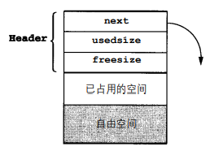


堆操作还需要的另一片数据是指向环形链接的列表中的一个块的指针。这个指针称作memptr，它总是指向具有一些自由空间的块(通常是被分配或释放的最后一个空间)。它被初始化为NULL，但是在malloc的第一次调用上，对初始化代码的执行是通过将memptr设置为堆数组的开头并初始化数组的头部，如下所示：


这个在第1次调用malloc时分配的初始化头部永远也不会被释放。这时在列表中有一个块，而其余的malloc代码搜索该列表并从具有足够自由空间的第1个块中返回一个新块(这是首次适用(first fit)算法)。因此在对malloc的3次调用之后，该列表看起来应是这样的：

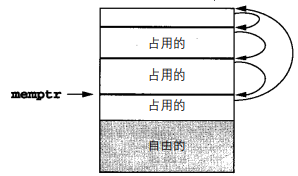

注意，当连续分配块时，每次都会生成一个新块，并且还有前面块所剩下的自由空间(因此从块的自由空间生成的分配总是将free size设置为0)。memptr跟随在新块的构造之后，所以它总是指向某个自由空间的块。大家还要注意，malloc总是增加指向新创建块的指针，所以也将头部保护起来而不会被客户程序覆盖(只要在返回存储器中使用正向偏移)。

现在来考虑free过程的代码。它首先把用户传递的指针减1（`bp = (Header *)ap - 1`），以找到块的头部。接着它再搜索列表以寻找与之相同的指针，以保护该列表防止坏掉，而且还能计算指向先前块的指针。一旦找到就将该块从列表中删除，且将其使用过的和自由空间都添加到先前块的自由空间中，所以也就自动地合并了自由空间。请读者注意，还将memptr设置为指向包含了刚才释放的存储器的块。

例如，假设将上图中3个使用过的块的中间一个释放了，则堆和与之相关的块列表应如下所示：

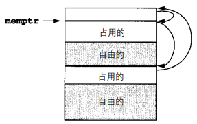

经测试可用的代码：

```c
#define NULL 0
#define MEMSIZE 8096 /* change for different sizes */

typedef double align;
typedef union header {
    struct {
        union header *next;
        unsigned usedsize;
        unsigned freesize;
    } s;
    align a;
} header;

static header mem[MEMSIZE];
static header *memptr = NULL;

void *malloc(unsigned nbytes) {
    header *p, *newp;
    unsigned nunits;
    nunits = (nbytes + sizeof(header) - 1) / sizeof(header) + 1;
    if (memptr == NULL) {
        memptr->s.next = memptr = mem;
        memptr->s.usedsize      = 1;
        memptr->s.freesize      = MEMSIZE - 1;
    }
    for (p = memptr; (p->s.next != memptr) && (p->s.freesize < nunits); p = p->s.next)
        ;
    if (p->s.freesize < nunits)
        return NULL;
    /* no block big enough */
    newp             = p + p->s.usedsize;
    newp->s.usedsize = nunits;
    newp->s.freesize = p->s.freesize - nunits;
    newp->s.next     = p->s.next;
    p->s.freesize    = 0;
    p->s.next        = newp;
    memptr           = newp;
    return (void *)(newp + 1);
}

void free(void *ap) {
    header *bp, *p, *prev;
    bp = (header *)ap - 1;
    for (prev = memptr, p = memptr->s.next; (p != bp) && (p != memptr);
         prev = p, p = p->s.next)
        ;
    if (p != bp)
        return;
    /* corrupted list, do nothing */
    prev->s.freesize += p->s.usedsize + p->s.freesize;
    prev->s.next = p->s.next;
    memptr       = prev;
}
```

## Auto Management of the heap

* manual method 
    * the use of malloc and free to perform dynamic allocation and de-allocation of pointer. 
* auto: garbage collection
    * the process of reclamation of allocated but no longer used storage without an explicit call to free.


**mark and sweep garbage collection**

* <u>no memory is freed until a call to malloc fails</u>, which does this in two passes.
    1. Follows all pointers recursively, starting with all currently accessible pointer values and marks each block of storage reached.
    2. Sweeps linearly through memory.
        * returning unmarked blocks to free memory.
        * perform memory compaction to leave only one large block of contiguous free space at the other end.
* Drawbacks
    * 要求额外的存储 (用于标识)
    * The double pass through memory 导致了很大的延迟


**stop-and-copy or two-space garbage collection**

* 将存储器分为两块
* During the marking pass, all reached blocks are immediately copied to the second half of storage not in use;
* 优点
    * No extra mark bit is required and only one pass is required;
    * It also performs compaction automatically. 
* 不足
    * It does little to improve processing delays during storage reclamation.

# Parameter Passing Mechanisms

* pass by value
* pass by reference
* pass by value-result
    * similar result to pass by reference, except that no actual alias is established.
        1. the value of the argument is copied and used in the procedure.
        2. the final value of the parameter is copied back out to the location of the argument.
* pass by name


**Difference of reference and value-result**

```c
void p(int x, int y) {
    ++x;
    ++y;
}
int main() {
    int a = 1;
    p(a, a);
    return 0;
}
```

* If pass by reference is used, a has value 3 after p is called.
* If pass by value-result, a has value 2 after p is called. 


**Pass by name**

the argument is not evaluated until its actual use in the callee.

```c
int i;
int a[10];

void p(int x) {
    ++i;
    ++x;
}

int main() {
    i    = 1;
    a[1] = 1;
    a[2] = 2;
    p(a[i]);
    return 0;
}
// The result of the call p(a[i]) is that a[2] is set to 3 and a[1] is left unchanged.
```

类似于宏？

```c
int i;
int a[10];

#define p(x) \
    {            \
        ++i;     \
        ++x;     \
    }

int main() {
    i    = 1;
    a[1] = 1;
    a[2] = 2;
    p(a[i]);
    return 0;
}
// 结果符合预期，但是不知道能不能这样理解
```

