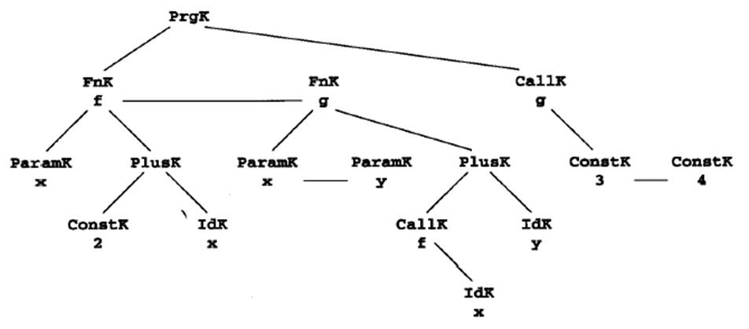

[TOC]

# Intermediate Code and Data Struct for CodeGen

## Three-Addr Code

in form of `x = y op z`

Ex.

```python
# 2 * a + (b - 3)

t1 = 2 * a
t2 = b - 3
t3 = t1 + t2

# 三地址码仅代表了从左至右的语法树线性化，因为首先列出了相对于根的左子树的求值的代码，编译器在某种情况下希望用另一种顺序也是有可能的

t1 = b - 3
t2 = 2 * a
t3 = t2 + t1

# 不一定要三个op
# 例如unary操作符负号
t1 = -t2
```

## DS for TAC

最通常的实现是将三地址码按其所显示的内容实现。这意味着有4个域是必需的：1个操作符和3个地址。对于那些少于3个地址的指令，将一个或更多的地域置成null或“empty”，具体选择哪个域取决于实现。

## P-Code

P-机器包括一个代码存储器、一个未指定的存放命名变量的数据存储器、一个存放临时数据的栈，还有一些保持栈和支持执行的寄存器。

```assembly
# 2 * a + ( b - 3 )
ldc 2 ; load constant 2 
lod a ; load value of variable a
mpi   ; integer multiplication 
lod b ; load value of variable b
ldc 3 ; load constant 3 
sbi   ; integer substraction 
adi   ; integer addition

# x := y + 1
lda x ; load address of x
lod y ; load value of y
ldc 1 ; load constant 1
adi   ; add
sto   ; store top to address below top & pop both
```


Ex. 计算整数阶乘

```pascal
{ sample program 
    in TINY language --
    computes factorial 
}
read x;  { input an integer }
if 0 < x then { don’t compute if x <= 0 }
    fact := 1;
    repeat 
        fact:=fact*x;
        x:=x-1
    until x=0;
    write fact { output factorial of x }
end
```

对应的Pcode：[编译原理及实践.pdf](file:///C:/Users/Ulysses/OneDrive - zju.edu.cn/Jun_B/CP/Res/教材/编译原理及实践.pdf) P314

# Basic CodeGen Techniques

## Intermediate Code or Target Code as a Synthesized Attr (Grammar)

目的：中间代码（例如三地址码或P-代码）怎样被作为合成属性定义

**Synthesized Attr**: 见Chap6

考虑仅有赋值和加法的语法：

```python
# terminator: id, num, +, = , (, )
exp → id = exp | aexp
aexp → aexp + factor | factor
factor → (exp) | num | id
```

将`(x = x + 3) + 4`转化为Pcode：

```assembly
lda x
lod x
ldc 3
adi
stn  ; stn和sto一样，都假设栈顶有一个值且下面有一地址。stn将值存入那个地址，但在丢弃那个地址时栈顶上仍保留了那个值 
ldc 4
adi
```

## Practical Code's Gen

```pseudocode
procedure genCode(T:treenode);
begin
    if T is not nil then
        generate code to prepare for code of left child of T;
        genCode(left child of T);
        generate code to prepare for code of right child of T;
        genCode(right child of T);
        generate code to implement the action of T;
end;
```

其中树节点的定义如下：

```c
typedef enum {Plus, Assign} optype;
typedef enum {OpKind, ConstKind, IdKind} NodeKind;
typedef struct streenode {
    NodeKind kind;
    Optype op;      // used with OpKind
    struct streenode *lchild, *rchild;
    int val;        // used with ConstKind
    char * strval;  // used for identifiers and numbers
} STreenode;
typedef STreenode *syntaxtree; 
```

生成PCode的`GenCode`在[编译原理及实践.pdf](file:///C:/Users/Ulysses/OneDrive - zju.edu.cn/Jun_B/CP/Res/教材/编译原理及实践.pdf)的P318

## IR 🚀 Target Code

这里的Target Code并非指最后执行的汇编或机器码，可以仍是一种IR，例如下文就用PCode->TAC和TAC->PCode举例了

the final code generation pass must supply 

* all the actual locations of variables and temporaries
* the code necessary to maintain the runtime environment


Code generation from intermediate code involves either or both of two standard techniques:
* macro expansion
    * replacing each kind of intermediate code instruction with an equivalent sequence of target code instructions
* static simulation
    * a straight-line simulation of the <u>effects</u> of the intermediate code and generating target code to match these effects

使用macro expansion进行转译

```assembly
# 三地址码 a = b + c 总是能翻译成如下PCode
lda a
lod/ldc b
lod/ldc c
adi
sto
```

但是会有问题

```assembly
# (x = x + 3) + 4

# Pcode
lda x
lod x
ldc 3
adi
stn 
ldc 4
adi

# to 3 addr，栈结构见书P320
t1 = x + 3
x = t1
t2 = t1 + 4

# back to PCode
lda t1
lod x
ldc 3
adi
sto

lda x
lod t1
sto

lda t2
lod t1
ldc 4
adi
sto
# 冗余了很多
```

可以使用static simulation+树的方式解决，见书P322

# CodeGen of Data Struct Reference

## Address Calculations

**TAC**

用`*`和`&`

```c
// 常量2存放在变量x加上10个字节的地址处, x[10] = 2;
t1 = &x + 10
*t1 = 2
```

对DS的修改：加入枚举型的AddrMode域，枚举值为None、Address和Indiredct


**PCode**

加入指令

* ind(间接装入)：用一个整型偏移量作为参数，假设栈顶上有一个地址，就将这个地址与偏移量相加得到新地址，再将**<u>新地址中的值</u>**压入栈以代替原来栈顶的地址。

    * 旧栈

        |  a   |
        | :--: |

    * 执行：`ind i`

    * 新栈

        | *(a+i) |
        | :----: |

* ixa(索引地址)：<u>用整型比例因子作为参数</u>，假设一个偏移量已在栈顶并且在其下边有一个基地址，则用比例因子与偏移量相乘，再加上基地址以得到新地址，再将偏移量和基地址从栈中弹出，压入**<u>新地址</u>**。

    * 旧栈

        |  i   |
        | :--: |
        |  a   |

    * 执行：`ixa s`

    * 新栈

        | a + s * i |
        | :-------: |

```assembly
# 常量2存放在变量x加上10个字节的地址处, x[10] = 2;
lda x
ldc 10
ida 1
ldc 2
sto
```

## Array Reference (Grammar)

**TAC**

引入`[]=`和`=[]`

```c
// t2 = a[t1]
t3 = t1 * elem_size(a)
t4 = &a + t3
t2 = *t4

// a[t2] = t1
t3 = t2 * elem_size(a)
t4 = &a + t3
*t4 = t1
```

**PCode**

```assembly
# t2 = a[t1]
lda t2
lda a
lod t1
ixa elem_size(a)
ind 0
sto

# a[t2] = t1
lda a
lod t2
ixa elem_size(a)
lod t1
sto
```

**CodeGen with Array Ref**

扩充文法：

```python
# terminator: =, +, ( ,) , [, ], id, num
exp → subs = exp | aexp
aexp → aexp + factor | factor
factor → ( exp ) | num | subs
subs → id | id [ exp ]  # 普通var或带下标的var
```

**Multidimensional Array**

递归使用一位数组的描述

## CStruct and Pointer Reference

**TAC**

引入函数`field_offset`

```c
// 计算x.j的地址并存入临时变量t1
t1 = &x + field_offset(x,j)

// x.j = x.i
t1 = &x + field_offset(x,j)
t2 = &x + field_offset(x,i)
*t1 = *t2
```

**PCode**

```assembly
# x.j的直接地址
lda x
lod field_offset(x,j)
ixa l

# x.j = x.i
lda x
lod field_offset (x,j)
ixa 1
lda x
ind field_offset (x,i)
sto

# p -> lchild = p; 
# p = p -> rchild;
lod p
lod field_offset (*p, lchild)
ixa 1
lod p
sto

lda p
lod p
ind field_offset(*p, rchild)
sto
```

# CodeGen of Control Stat and Logical Expr

## `if` and `while`

**TAC**

```c
// if(E) S1 else S2
<code to evaluate E to t1>
if_false t1 goto L1
<code for S1>
goto L2
label L1
<code for S2>
label L2

// while(E) S
label L1
<code to evaluate E to t1>
if_false t1 goto L2
<code for S>
goto L1
label L2
```

**PCode**

```assembly
# if(E) S1 else S2
<code to evaluate E>
fjp L1  ; false jump
<code for S 1>
ujp L2  ; unconditional jump
lab L1
<code for S 2>
lab L2

# while(E) S
lab L1
<code to evaluate E>
fjp L2
<code for S>
ujp L1
lab L2
```

## Gen of Labels and Backpatching

先做一个假的label，然后之后回填真正的地址（分为长跳短跳）

## Gen of Logical Expr

short circuit: 短路，例如表达式`true || ?`和`false && ?`都不需要知道`?`

使用短路来定义与或：

```c++
a and b = if a then b else false
a or b  = if a then true else b
```

因此可以用`if`形式的IR来表示他们：

```assembly
# (x != 0) && (y == x)
    lod x
    ldc 0
    neq
    fjp L1  ; fjp will pop top `false`?
    lod y
    lod x
    equ
    ujp L2  ; result is as same as top which is now `y == x ?`
lab L1
    lod FALSE
lab L2
```

## Sample CodeGen for `if` and `while` (Grammar)

语法：

```python
# terminals: break, other, if, while, else, true, false, (, )
# other代表没有包括在文法中的语句(如赋值语句)，它也仅包括常量布尔表达式true和false
stmt → if-stmt | while-stmt | break | other
if-stmt → if ( exp ) stmt | if ( exp ) stmt else stmt
while-stmt → while ( exp ) stmt
exp → true | false
```

==Demo==

```assembly
# if (true) while (true) if (false) break else other

# if (true)
#     while (true)
#         if (false)
#             break
#         else
#             other

ldc true  ; if(true)
fjp L1
    lab L2
    ldc true  ; while(true)
    fjp L3
        ldc false   ; if(false)
        fjp L4      ; else
            ujp L3  ; break
        ujp L5      ; continue
        lab L4  ; `if(false)`'s false jump
            Other
    lab L5  ; next label of `while(true)`
    ujp L2
    lab L3  ; exit label of `while(true)`, also `if(false)`'s true jump
lab L1  ; exit label of `if (true)`
```

# CodeGen of Procedure and Func Calls

## Intermediate Code for Procedures and Functions

```c
// 函数体
Entry instruction
<code for the function body>
Return instruction

// 调用
Entry instruction
<code for the function body>
Return instruction
```

**TAC**

```c
// int f ( int x, int y ) { return x + y + 1; }
entry f
t1 = x + y
t2 = t1 + 1
return t2

// f(2+3, 4)
begin_args  // 零地址指令
t1 = 2 + 3  // 被用于重复地说明参数值的指令
arg t1
arg 4
call f
```

**PCode**

```assembly
ent f  ; 入口
lod x
lod y
adi
ldc 1
adi
ret    ; 返回


mst    ; "mark stack", 对应begin_args
ldc 2
ldc 3
adi
ldc 4
cup f  ; "call user procedure"
```

## Codegen Procedure for Func def and call (Grammar)

此处的procedure是codegen的主语

语法：

```python
# terminal: fn, id, num, (, ), ','
program → decl-list exp
decl-list → decl-list decl | ε
decl → fn id ( param-list ) = exp
param-list → param-list , id | id
exp → exp + exp | call | num | id
call → id ( arg-list )
arg-list → arg-list, exp | exp
```

Syntax Tree定义：

```c
typedef enum { PrgK, FnK, ParamK, PlusK, CallK, ConstK, IdK } NodeKind;
typedef struct streenode {
    NodeKind kind;
    struct streenode *lchild, *rchild, *sibling;
    char *name; /* used with FnK,ParamK,Callk,IdK */
    int val;    /* used with ConstK */
} StreeNode;
typedef StreeNode *SyntaxTree;
```

`fn f(x) = 2 + x; fn g(x, y) = f(x) + y; g(3, 4);`的语法树：



生成PCode的代码见[编译原理及实践.pdf](file:///C:/Users/Ulysses/OneDrive - zju.edu.cn/Jun_B/CP/Res/教材/编译原理及实践.pdf)的P340

# Code Generation in Commercial Compilers

看ppt

# Code Optimizations

* **Register Allocation**
* Unnecessary Operations
* **Costly Operations**

