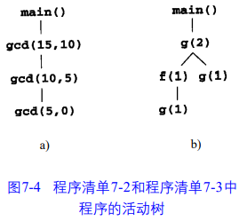

* Auto Management of the heap
* Mapping
    * syntax tree:
    * parse tree
    * annotated tree
    * token string
    * 源代码(sanner, lexical, Lex)tokens(parser, syntax, yacc)syntax/parse tree(semantic analyzer)Annotated tree(源代码optimizer)中间码(code generator)目标码
    * 
* TAC和PCode的模板：if、while、短路
* activation tree
    * 
* L-attr
* attr as param and ret
* heap management
* value stack
* 常见PCode的整理（Res/Y_Notes里有

