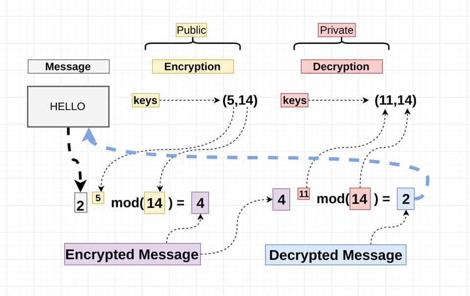
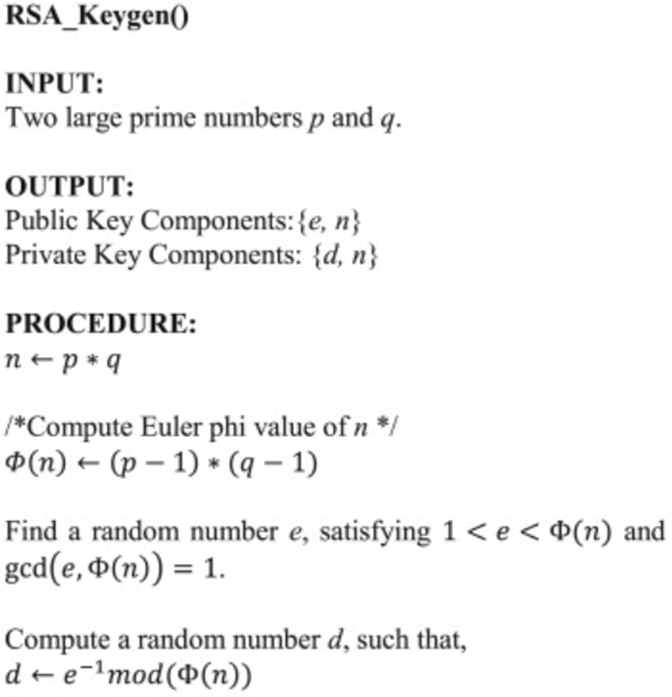
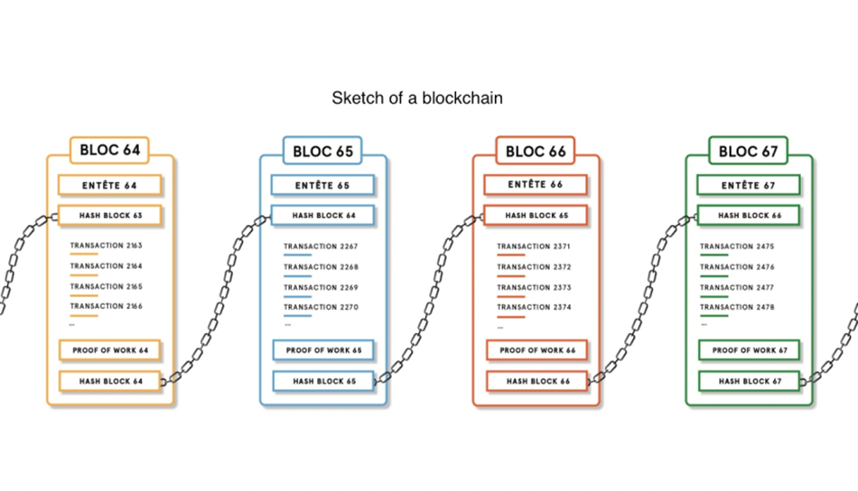
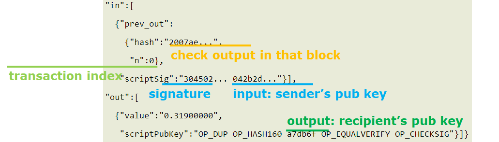
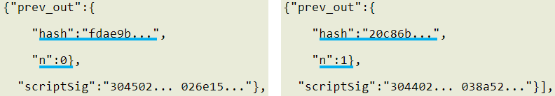

[TOC]

## Presiquite

### Asymmetric Cryptography

### RSA



[RSA (cryptosystem) - Wikipedia](https://en.wikipedia.org/wiki/RSA_(cryptosystem)#Key_generation)



## Bitcoin

### Possession

*transaction* = I, Alice, am giving Bob one bitcoin.

digital signature using Alice’s private key: *transaction* || Enc~priv~(hash(*transaction*))

digital sig verification using Alice’s public key: hash(transaction) == Dec~pub~(Enc~priv~(hash(transaction)))   ?

### Uniqueness

**Motivation**: is Alice paying two bitcoins? or is it a replay attack?

**Sol**: Giving <u>Serial Number</u>

transaction = I, Alice, am giving Bob bitcoin sn1.
transaction = I, Alice, am giving Bob bitcoin sn2.


More Issues

* is sn1 really belonging to Alice?
* who issues serial numbers?
* what if Alice pays sn1 to Charlie as well?


#### ledger

Aiming: *is sn1 really belonging to Alice?*


* <u>A block contains one or more transactions</u>
* everyone keeps complete record of which bitcoin belongs to which person, showing all bitcoin transactions;
* make everyone collectively the bank.
* follow transaction order, a block points to its previous transaction’s block







```
A block contains one or more transactions

hash: used to uniquely identifying a block in the blockchain;
n: 0: transaction index, as one block may contain more than one transaction
```


#### hash of a block

Aiming: *who issues serial numbers?*


maybe more transactions in a block; specify the exact transaction for use;




#### Double Spending

Aiming: *what if Alice pays sn1 to Charlie as well?*


*what if Alice first pays sn1 to Bob, and after a while, pays sn1 to Charlie?*

sn1 appears in two [in] fields in prev blocks!


*what if Alice simultaneously pays sn1 to Bob and Charlie?*

some users validate Alice-Bob; some Alice-Charlie: fork!

<u>follow the longest fork: accept the transaction until at least 5 more blocks follow it;</u>


*what if Alice simultaneously puts sn1 related Alice-Bob and Alice-Charlie in Block B?*


#### proof-of-work

*what if Alice pays sn1 to Bob, wait till accepted; then repays sn1 to Charlie, compute another longer fork?*


**51% attack**

(a group of) attacker controls more than 50% of the network’s computing power;

how much comp power should Alice have to win?  


#### Proof of stake (PoS)

**Motivation**

every participant joins blockchain by paying stake

when choosing creator of a block, more stake with high probability 


only one creator per block; no huge computation waste. 避免多端同时计算同个


**Self Mining Attack**

Attacker increases the share of the reward by not broadcasting mined blocks to the network for some time and then releasing several blocks at once, making other miners lose their blocks.

偷偷挖很多（不需要51%的算力），然后一次性加入公池，可能会超过原来的长度

