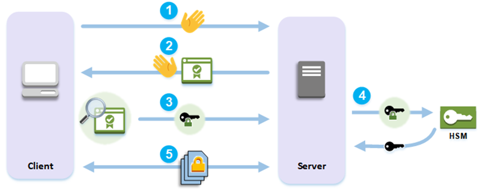
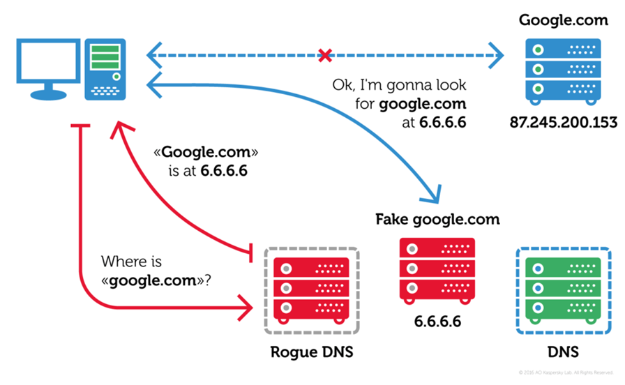
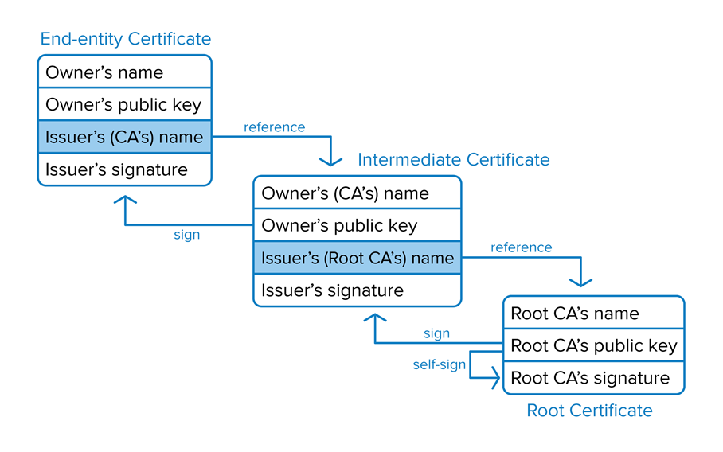

[TOC]

Sym的加密比公钥加密快

混合方式：用非对称加密传输堆成加密的shared key，之后通过对称加密进行通信

# Secure Con

## Basic Principle

1. The client sends a hello message to the server.
2. The server responds with a hello message and sends the <u>server's certificate</u>.
3. The client performs the following actions:
    1. <u>Verifies that the SSL/TLS server certificate is signed by a root certificate that the client trusts.</u>
    2. Extracts the <u>public key</u> from the server certificate.
    3. Generates a premaster `secret` and encrypts it with the <u>server's public key</u>.
    4. Sends the encrypted premaster `secret` to the server.
4. To decrypt the client's premaster `secret`, the server sends it to the hardware security module HSM. The HSM uses the <u>private key in the HSM</u> to decrypt the premaster `secret` and then it sends the premaster `secret` to the server. Independently, the client and server each use the premaster `secret` and some information from the hello messages to <u>calculate a `master secret`</u>.
5. The handshake process ends. For the rest of the session, all messages sent between the client and the server are <u>encrypted with derivatives of the `master secret`</u>.

# HTTPS

## Threats

* Eavesdropping
    * sol: Encryption
* Manipulation
    * attacker redirects and modifies packets
    * sol: Integrity
        * MAC: message authentication code
* Impersonation 扮演 模仿
    * attacker impersonates an (authorized) user
    * sol: Signature

# HTTPS: Connection Request

# DNSSEC

[Domain Name System Security Extensions](https://en.wikipedia.org/wiki/Domain_Name_System_Security_Extensions)

[域名系统安全扩展 - 维基百科，自由的百科全书](https://zh.wikipedia.org/wiki/%E5%9F%9F%E5%90%8D%E7%B3%BB%E7%BB%9F%E5%AE%89%E5%85%A8%E6%89%A9%E5%B1%95)

https://medium.com/iocscan/how-dnssec-works-9c652257be0

## DNS Threats

问题：获得错误的IP

## Prelude

### Digital Signature

怕DNS被劫持

* RRset: a set of resource records to sign
* ZSK: zone-signing key pair: pub + priv
* RRSIG: signature of RRset by priv
* DNSKEY: public ZSK

### Prelude

1. The resolver queries the DNS server for a record (ex. A) 
2. The DNS server returns the RRset containing the record as well as the RRSIG record containing the signature of RRset signed by the ZSK
3. The resolver then queries the DNS server for the DNSKEY record to retrieve the public ZSK to validate the signature

### Man-in-the-middle Attack

https://zh.wikipedia.org/wiki/%E4%B8%AD%E9%97%B4%E4%BA%BA%E6%94%BB%E5%87%BB

> **中间人攻击**（英语：**M**an-**i**n-**t**he-**m**iddle attack，缩写：**MITM**）在[密码学](https://zh.wikipedia.org/wiki/密码学)和[计算机安全](https://zh.wikipedia.org/wiki/计算机安全)领域中是指攻击者与通讯的两端分别创建独立的联系，并交换其所收到的数据，使通讯的两端认为他们正在通过一个私密的连接与对方直接对话，但事实上整个会话都被攻击者完全控制。在中间人攻击中，攻击者可以拦截通讯双方的通话并插入新的内容。在许多情况下这是很简单的（例如，在一个未加密的[Wi-Fi](https://zh.wikipedia.org/wiki/Wi-Fi) [无线接入点](https://zh.wikipedia.org/wiki/无线接入点)的接受范围内的中间人攻击者，可以将自己作为一个中间人插入这个网络）。
>
> 一个中间人攻击能成功的前提条件是攻击者能将自己伪装成每一个参与会话的终端，并且不被其他终端识破。中间人攻击是一个（缺乏）相互[认证](https://zh.wikipedia.org/wiki/认证)的攻击。大多数的加密协议都专门加入了一些特殊的认证方法以阻止中间人攻击。例如，[SSL](https://zh.wikipedia.org/wiki/SSL)协议可以验证参与通讯的一方或双方使用的证书是否是由权威的受信任的[数字证书认证机构](https://zh.wikipedia.org/wiki/数字证书认证机构)颁发，并且能执行双向身份认证。

A发给B的自己的公钥通过了中间人，中间人将自己的公钥发给B，让B以为这是A的公钥。B收到了这个以为是A实际上是中间人的公钥，并用此加密，以为只有A能看到信息，但实际上只有中间人能看。

### DNS Hijacking

## Interlude

### Digital signature of public ZSK

怕ZSK被篡改

* KSK: key-signing key pair
* additional RRSIG: signature of public ZSK by private KSK
* additional DNSKEY: public KSK

### Interlude

4. The DNS server returns the RRset containing ZSK, KSK, and RRSIG record containing the signature for the RRset of both ZSK and KSK.
5. The resolver verifies the RRSIG for the request RRset (the A records) with the public ZSK
6. If that passes, then it validates the ZSK by comparing the RRSIG of the DNSKEY RRset with the public KSK

# HTTPS: Server Response

## SERVER HELLO

​	SSL Protocol version
​	Session ID
​	Selected Cipher
​	Server Certificate               Public Key?
​	SERVER HELLO Extensions
​	Client Certificate Request (optional)

# HTTPS: Certificate Verification

* Certificate Authority
    * trusted?
    * certificate integrity?
* Certificate Date
    * expired?
* Certificate Revocation List
    * valid?
* Domain Name
    * intended?

<u>Domain Name, Public Key, CA Name, CA Signature</u>

* CA: <u>query locally built-in certificate store</u>
* Use *Public Key* to veriy the *CA Signature*'s integrity and authenticity

**Certificate Chain**

