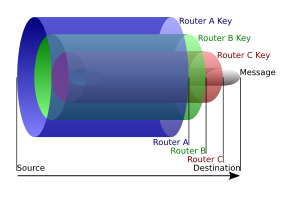

# TOR

## 数据结构[[编辑](https://zh.wikipedia.org/w/index.php?title=洋葱路由&action=edit&section=2)]

> 
>
> 一个在洋葱路由网络中传递的数据包例子。发送者首先将数据包发送给路由器A，解密了蓝色一层，并发现要传给B，而数据包发送至B时又解密了绿色一层，同理再传给C，而C在解密了红色一层后得到原始要发送的消息并将之传给目的地。

被称作洋葱路由的原因在于[消息](https://zh.wikipedia.org/wiki/訊息)一层一层的加密包装成被称作洋葱数据包的[数据结构](https://zh.wikipedia.org/wiki/資料結構)，层数取决于到目的地中间会经过的节点数，每经过一个节点层会将数据包的最外层解密，因此任一个节点都无法同时知晓这个消息最初与最终的目的地，使发送者达到匿名的效果。[[11\]](https://zh.wikipedia.org/wiki/洋葱路由#cite_note-tor-design-11)

### 数据包的创建与发送

为了发送洋葱数据包，发送消息者会从“目录节点”（directory node）提供的列表中选取一些节点，并以这些规划出一条被称作“链”（chain）或“线路”（circuit）的发送路径，这条路径将为传输数据包所用。为了确保发送者的匿名性，任一节点都无法知道在链中自己的前一个节点是发送者还是链上的另一节点；同理，任一节点也无法知道在链中自己的下一节点是目的地还是链上另一节点。只有链上的最后一个节点知道自己是链上最终节点，该节点被称作“出口节点”（exit node）。[[11\]](https://zh.wikipedia.org/wiki/洋葱路由#cite_note-tor-design-11)

洋葱路由网络使用[非对称加密](https://zh.wikipedia.org/wiki/公开密钥加密)，发送者从目录节点获得一把公开密钥，用之将要发送的消息加密并发送给链上的第一个节点，该节点又被称作入口节点（entry node）；其后与之创建连线和[共享密钥](https://zh.wikipedia.org/w/index.php?title=共享密鑰&action=edit&redlink=1)。创建连线后发送者就可以通过这条连线发送加密过的消息至链上的第二个节点，该消息将只有第二个节点可以解密；当第二个节点收到此消息后，便会与前一个节点也就是入口节点同样的创建连线，使发送者的加密连线延伸到它，但第二个节点并不晓得前一个节点在链中的身份。之后按照同样原理，发送者通过入口节点和第二个节点的这条加密连线将只有第三个节点能解密的消息发送给第三个节点，第三节点同样的与第二个节点创建连线；借由重复相同的步骤，发送者能产生一条越来越长的连线，但在性能上仍有限制。[[11]](https://zh.wikipedia.org/wiki/洋葱路由#cite_note-tor-design-11)

当链上的连线都创建后，发送者就可以透过其发送资料并保持匿名性。当目的地回送资料时，链上的节点会透过同一条连线将资料回传，且一样对资料层层加密，但加密的顺序与发送者完全相反；原发送者收到目的地回传的资料时，将仅剩最内一层加密，此时对其解密就可拿到目的地回送的消息。[[11\]](https://zh.wikipedia.org/wiki/洋葱路由#cite_note-tor-design-11)

