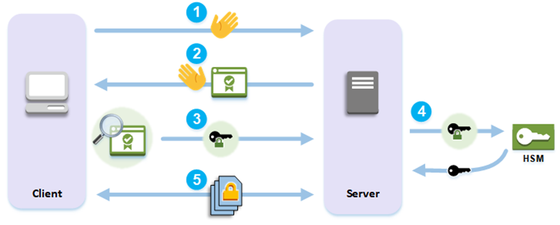
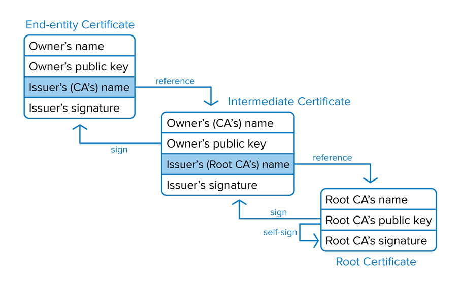

<p style='font-size: 44pt; text-align: center'>《网络安全原理与实践》<br />复习笔记</p>

[TOC]

# 01 Crypotography

## 1-1 symmetric & asymmetric cryptography

密码学遵循的四点原则：

* confidentiality -- secrecy
* integrity -- accuracy
* authentication -- ascription
* non-repudiation -- liability

Symmetric

- only a private key, both encryption and decryption

- Disadvantages: too many keys：1 key for each pair

Asymmetric: private + public key

- do not require  secure channels for key exchange
- private communication over public internet
- Many-to-one: 公钥加密，私钥解密；用于加密
- One-to-many: 私钥加密，公钥解密，私钥相当于签名；用于签名

## 1-2 RSA algorithm

了解加密解密方法：

```
encrypted_msg = original_msg^e mod n
decrypted_msg = encrypted_msg^d mod n
```

了解如何生成公钥私钥：

```markdown
# INPUT:
2 large prime numbers p and q

# OUTPUT:
Public Key Components: {e, n}
Private Key Components: {d, n}

# PROCEDURE:
1. n <-- p * q
2. Compute Euler phi value of n: Φ(n) <- (p-1) × (q-1)
3. Find a random number e, satisfying 1 < e < Φ(n) and gcd(e, Φ(n)) == 1
4. Compute a random number d, such that, d×e = 1 (mod Φ(n))
```

## 1-3 some attacking models

作为攻击者，并不需要得知密钥就可以达到攻击效果，如以下几种攻击模型

Replay attack

- 攻击者通过观察到某段密文对应的动作，将密文与动作相对应，发送该密文则可使被攻击者作出相应动作
- Defense：时间戳、一次性key、unique包

Man-in-the-middle attack

- 两个通信者实际上都在跟监听者通信
- Defense: guarantee connection authenticity

Relay attack

- 可以用来偷车
- 攻击者在相距较远的节点转发信息给某节点，让其误以为自己在跟与其距离较近的一个节点通信
- Defense：distance bounding (计算RTT)，但容易误伤本就距离较远的正常通信节点，且如果攻击者较近，攻击也不会被察觉
- 与中间人攻击的区别：中间人的通信双方是自己初始化的；relay的通信双方是被攻击者初始化的

# 02 Blockchain

## 2-1 Digital Signature

掌握CA的签名过程（在[这里](#03 secure connection)）

掌握数字签名的验证（非对称的one-to-many）

## 2-2 Bitcoin Basics

比特币的签名过程（签名证明比特币所有者，签名过程即为数字签名过程）

uniqueness

- 交易过程中要保证每枚比特币的唯一性，一个比特币不可以被支付给两个人
- 在transaction中采用serial number标记

标记后，交易过程中还需注意：

- 由sn1标记的bitcoin是否属于Alice
  - everyone keeps complete record of which bitcoin belongs to which person, showing all bitcoin transactions（区块链）
  - block与block间相互连接
  - 交易过程（用签名证明身份）
- serial number是由谁提供的
  - 由hash block提供（怎么提供？哈希值？）
- 如果sn1被重复支付两次，会引发什么动作（double spending）
  - Sn1 appears in two [in] fields in previous blocks
  - 考虑先付者为valid
  - 如果同时支付，则发生fork，follow the longest fork, accept the transaction until at least 5 more blocks follow it（缺点：因为计算能力快的人可以在相同时间获得较长的chain，所以可以生成比其他chain都要长的chain为所欲为）
  - sn1先被支付给Bob，待accept之后又被支付给Charlie (computing a longer fork)，解决方法：proof-of-work机制（使validate一个block的时间变长，这样第二次就无法形成一个longer fork

Proof-of-work

- find a nonce x such that h(msg,x) leads with 10 zeroes（block hash由十个前导0构成，每一位可以表示为一个十六进制数字）
    - 当某个人算出一个哈希后的数字比系统给出的值C小，即可认证计算成功。
- 找到合理的block hash值需要经过大量运算 ((1/16)^10^)，这样就保证了短时间内无法建立较长chain，防御了上述最后一个攻击
    - 51% attack：当一组攻击者掌握了50%以上的网络资源时，就可以为所欲为
        - 但是这种方法有些过于暴力，算出来的结果很多都被浪费了

Proof-of-stake

- only one creator per block; no huge computation waste
- Every participant joins blockchain by paying stake，交钱越多，被选中成为chain的几率越大
- 如果block通过了verification，creator可以获得stake reward，否则会penalty

## 2-3 Mining Attacks

selfish mining attack

- 正常挖矿中，挖到后会立即广播结果，防止被别人抢走
- 攻击者hold blocks for some time and release several blocks at once
- <u>使其他miners失去他们较短的block chain</u>
- increase the share of reward
- 极端情况下会使得其他人无法获益，自己获得100%的收益

block withholding attack（在此处可以认为与selfish等同）

sybil attack

- hacker takes control of multiple nodes
- victim is surrounded by fake nodes that close up all their transactions

eclipse attack（eclipse与sybil可以认为等同，只需要知道后两个与前两个的区别即可）

- hacker controls a large number of IP addresses or a distributed botnet
- victim directs all outgoing connections to the IP addresses controlled by the attacker

# 03 secure connection

证书认证的五个步骤（知道前三个即可）



1. The client sends a hello message to the server.
2. The server responds with a hello message and sends the <u>server's certificate</u>.
3. The client performs the following actions:
    1. <u>Verifies that the SSL/TLS server certificate is signed by a root certificate that the client trusts.</u>
    2. Extracts the <u>public key</u> from the server certificate.
    3. Generates a premaster `secret` and encrypts it with the <u>server's public key</u>.
    4. Sends the encrypted premaster `secret` to the server.
4. To decrypt the client's premaster `secret`, the server sends it to the hardware security module HSM. The HSM uses the <u>private key in the HSM</u> to decrypt the premaster `secret` and then it sends the premaster `secret` to the server. Independently, the client and server each use the premaster `secret` and some information from the hello messages to <u>calculate a `master secret`</u>.
5. The handshake process ends. For the rest of the session, all messages sent between the client and the server are <u>encrypted with derivatives of the `master secret`</u>.

## 3-1 connection request

DNS Hierarchy图

DNS resolution

DNS Hijacking

此步骤中client hello包括

- SSL Protocol version
- Session ID
- List of Cipher Suites
- CLIENT HELLO Extensions

## 3-2 server response

Server hello

- SSL Protocol version
- Session ID
- Selected Cipher
- Server Certificate (public key)，由CA(第三方)签发
- SERVER HELLO Extensions
- Client Certificate Request (optional)

## 3-3 certificate verification

### Normal

what to verify

* Certificate Authority
    * trusted?
    * certificate integrity?
* Certificate Date
    * expired?
* Certificate Revocation List
    * valid?
* Domain Name
    * intended?

how to verify (见数字签名验证，此处建议参考lf中文ppt，比较清晰)


branch CA溯源的步骤（图）

CRL check (is a valid certificate still valid)

- certificate revocation list
- 两种状态
  - revoked：永久失效
  - hold：暂时失效

（最后一页ppt meo看懂？）

### Chain

> **d**. When is a certificate chain required?

<u>When the certification is signed by a CA that is not trusted.</u>

> How to authenticate a certificate chain?

There are two types of certificate authorities (CAs): root CAs and intermediate CAs. For an SSL certificate to be trusted, that certificate must have been issued by a CA that’s included in the trusted store of the device that’s connecting.

If the certificate wasn’t issued by a trusted CA, the connecting device (eg. a web browser) checks to see if the certificate of the issuing CA was issued by a trusted CA. It continues checking until either a trusted CA is found (at which point a trusted, secure connection will be established), or no trusted CA can be found (at which point the device will usually display an error).

The list of SSL certificates, from the root certificate to the end-user certificate, represents the SSL certificate chain.



[What is the SSL Certificate Chain? - DNSimple Help](https://support.dnsimple.com/articles/what-is-ssl-certificate-chain/)

# 04 Anonymous

问一下packet会不会考/会不会给？

## 4-1 Anonymous Communication

实现方法：

- hide destination address

- Relay

Overlay network

- handle routing at the <u>application layer</u>
- tunnel messages inside other messages

## 4-2 Anonymous Proxy

- Intermediary between sender and receiver
- sender relays all traffic through proxy
- encrypt destination and payload
- asymmetric technique: receiver not involved(informed of) anonymity (之后ppt好像不是这样的??)
- receiver 作为 attacker 时，匿名可以保护sender不被识别身份信息
- 优点:
  - easy to configue
  - require no active participation of receiver, which needn't be aware of anonymity service
  - have been widely deployed on Internet
- 缺点：
  - Require trusted third party proxy
  - may release logs, or sell them, or blackmail sender
  - Anonymity largely depends on the location of the attacker
- evade attacker ——source routing (specify on-path routers by source)

## 4-3 routing used for anonymity

POF-based source routing（了解POF本身不匿名，在源头就port bound即可）

- POF: Protocol Oblivious Forwarding
- Port bound, Port sequence leaked
- 为了匿名：hide ports from non-neighbors

onion-routing

- source routing based
- overlay communication
- Anonymous
- use onion router called Tor
- Steps:
    - connect to Tor entry
    - randomly select a series of Tors
    - relay messages across them
    - Tor exit relays messages to destination
- Leaked routing info: neighborship only

# 05 secure routing

## ~~5-1 Routing Basics~~

~~routing scheme~~

- ~~Intra-domain routing: inside an autonomous system~~
- ~~Inter-domain routing: between autonomous systems~~

~~Hierarchical routing~~

- ~~each AS uses its own IGP (内部网关协议) routing protocol~~
- ~~border routers run BGP as well~~

~~IGP: Interior Gateway Protocol~~

- ~~RIP (Routing Information Protocol)~~
- ~~OSPF (Open Shortest Path First)~~

~~BGP: Border Gateway Protocol(细节考吗？)~~

- ~~Path-vector protocol~~

## ~~5-2 Route Computation~~

~~Link-state algorithms （Dijkstra算法+OSPF Protocol）~~

- ~~each router knows complete topology & link cost information~~
- ~~calculate shortest path to destination~~

~~Distance-vector （Bellman-Ford算法）~~

- ~~know direct neighbors & link costs to neighbors~~

## 5-3 Routing attacks

Distance-vector: annouce 0 distance to all other nodes

Link-state: drop links; claim direct link to other routers

BGP: annouce arbitrary prefix; alter paths

routing attacks and examples

## 5-4 Attacking examples

**Prefix Hijacking**

* 宣称有路实际上没有：用一个掩码更短的域ip

**Path Tampering** 篡改路径

* 宣称路更短实际上更长，这样就会经过自己
* [Route Tampering in Ad-Hoc Networks | Study.com](https://study.com/academy/lesson/route-tampering-in-ad-hoc-networks.html)

Defense：Resource Public Key Infrastructure（不允许未经认证的设备随意设置自己的ip，但是不能defend所有，攻击者可以声明自己离目标比较近，迫使路由选择在自己所在的路径）

# 06 Wi-Fi

## 6-1 Wifi Basics

Higher Security Risk

- 无线网络通信通常包含广播通信，更容易被攻击

- Higher mobility: far more portable and mobile, thus resulting in a number of risks
- Contrained resource: sophisticated OS but limited memory and processing resources to counter threats, including DoS and malware
- Greater Accessibility: may be left unattended in remote or hostile locations, thus greatly increasing their vulnerability to physical attacks

what to secure

- Confidentiality: messages sent over wireless links must be encrypted
- Authenticity: origin of messages received over wireless links must be verified
- Integrity: integrity of messages received over wireless links must be verified
- replay detection: freshness of messages received over wireless links must be checked
- Access control: access to the network services should be provided only to legitimate entities

how to attack

- Passive attack
  - passive information-gathering
  - offline attack over the gathered information of snooped packets
  - eg. key cracking
- active attack
  - Manipulate wireless communication
  - eg. packet injection, DoS

## 6-2 attack examples

Rogue AP

- 一个被安装在secure network上的wireless access point
- without explicit authorization from a local admin

Evil Twin AP

- 一个模仿真AP的SSID (service set ID)的假AP
- 一个real AP，一个Rougue AP，且后者有<u>stronger signal</u>
- phishing
    - steal password
    - intercept transactions

Man-In-The-Middle

- based on rogue AP / evil twin AP
- 与有线网络的中间人攻击相似

Replay Attack

- 攻击者重复发送sender发送的包给receiver
- exhaust the energy or power supply
- can crash apps which are designed poorly

Denial of Sleep

- 为节约电量，无线应用通常有三个mode：active, idle, sleep
- 此攻击是 trigger wireless devices by signals, such that they keep active and drain power
- more drained nodes lead to network disruption

Collision Attack

- overlapping channels between user and attacker
- attacker interferes with user communication by sending packets that collide with user's, then user's packet are discarded

Jamming

- deliberate jamming, blocking or interfering with authorized wireless communication
- to launch Wireless DoS attack

## 6-3 Secure Wi-Fi

### WEP

==**Wired Equivalent Privacy (WEP)**==

- 让Wi-Fi至少与wired LAN一样安全
- access control to network：连接之前，STA(station)需要向AP证明自己的合法性
  - Challenge-response authentication
  - 验证成功后，STA发送一个association request，AP回复一个association response
- message confidentiality
- message integrity


**WEP Encryption**


* Message
* ICV: Integrity Check Value
* Plaintext = Message || CRC
    * CRC: for integrity check
* Keystream: IV || Key
    * IV (Initialization Vector): 24-bit number
    * Key: 40 or 104-bit number
* Ciphertext = IV || (plantext \^ keystream)


步骤看PPT 274开始

En

1. Compute CRC(msg), get plaintext = Message || CRC
2. Compute the keystream = IV || Key (For RC4)
3. Encrypt the plaintext = IV || (plantext \^ keystream)

De

1. Build the keystream
    1. Extract the IV from the incoming frame
    2. Prepend the IV to the key (???)
    3. Use RC4 to build the keystream
2. Decrypt the plaintext(= keystream \^ ciphertext) and verify


补充：

1. IV即初始向量（IV，Initialization Vector），在有线等效保密（WEP）协议中，IV是用来和密钥组合成密钥种子，作为RC4算法的输入，来产生加密字节流对数据进行加密的。
2. 它加解密使用相同的密钥，因此也属于对称加密算法。<br />由于[异或运算](https://zh.wikipedia.org/wiki/异或)的[对合性](https://zh.wikipedia.org/wiki/對合)，RC4加密解密使用同一套算法。


==**WEP weakness**==

1. AP not authenticate to STA
2. 24-bit IV in plaintext (why weak??)
3. CRC is unkeyed function
4. RC4 cipher: week seeds (IV) make moer easily calculated keystreams

### 802.11i

secure Wi-Fi more: IEEE 802.11i（elements是否需要掌握）

- Authentication: enforce **mutual** authentication (against weakness 1)
- Access control
  - Enforces authentication
  - Routes messages properly
  - Facilitates key exchange
- Privacy with Message Integrity (against 3)
- To secure data trans:
    - Temporal Key Integrity Protocol (TKIP)
      - 可以保证上面WEP的message confidentiality和message integrity要求
      - 与old WEP相比，只需要软件更新即可实现
      - message confidentiality: provided by encrypting the MPDU
      - message integrity: adds a message integrity code to the 802.11 MAC frame after the data field
    - Counter mode CBC MAC Protocol (CCMP)
      - Intended for newer IEEE 802.11 devs that are equipped with the hardware to support this scheme
      - data confidentiality: Use the CTR block cipher mode of operation with AES for encryption
      - message integrity: use the cipher-block-chaining message authentication code (CBC-MAC)

# 07 Denial-of-Service Attack

## 7-1 DoS & DDoS

DoS

-
    - Control an attacking computer/device
    - Flood victim with superfluous requests
    - <u>Overload victim and prevent it from fulfilling some legitimate requests</u>
- Defense: block the attacking source

DDoS

- Distributed DoS
- control many different attacking sources
- make it harder to stop the attack simply by blocking a single source
- 对称和非对称DDoS攻击（肉鸡的利用）

## 7-2 Generic DoS

数据链路层

- send too much traffic for switches/routers to handle

网络层（smurf）(asymmetric DDoS)

- amplify the effect of ping flood (router & firewall可以作为放大器)

- expoilt IP broadcast address

- forward single ICMP Echo Request（目的为网络的广播地址） to <u>any hosts</u> in the same network

- each host responds with an ICMP Echo Reply

- 1 request vs many replies

- 因为系统会优先处理ICMP报文，所以无法及时处理其他的网络服务

- 利用定向广播技术，需要攻击者、受害者和放大网络三部分

- Defend：

    - Disable IP broadcast addresses on router and firewall
    - Reject external packets to broadcast address

    - 用路由器的访问控制机制保证内部网络中所有发出的包都合法；
    - 防火墙状态表可以表明这些攻击会话不是本地网络中发出的（状态表中没有最初的echo请求记录），因此把这些信息丢弃

传输层（SYN Flood）

- require servers to maintain large number of concurrent connections or state
- SYN packets with random source IP addresses
- fill up backlog queue on server, no further connections possible
- 利用TCP三次握手的特点，不完成最后一次握手，使服务器一直等待直至超时（这样的连接称为半开连接）
- TCP handshake图
- 具体实现：向服务器发送大量伪造IP地址的TCP连接请求，由于IP地址是伪造的，无法完成最后一次握手，此时服务器中有大量半开连接存在，这些半开连接占用了服务器的资源，使服务器无法响应新的正常连接
- Defend：increase backlog queue size; decrease timeout; SYN cookies(不考)

应用层

- Require servers to perform expensive queries or cryptographic operations
- 短期内建立大量合法TCP连接，当连接数量超过上限，达到拒绝服务的目的
- Defend：禁止同一个IP地址发起连接

Other amplifiers

- DNS Amplification Attack
  - amplify the effect of DNS query
      - 源IP填的是受害人的
      - 包中使用ANY这样的参数来确保应答的结果最大化
  - 1 query vs many responses
  - Defend:
    - reduce the number of open resolvers
    - source IP verification
- NTP Amplification Attack
  - leverage Network Time Protocol servers
  - ==monlist==
      - monlist is a debugging command that allows to retrieve information from the monitoring facility about traffic associated with the NTP service.
  - amplify the effect of NTP query
  - 1 query vs large responses
  - Defend:
    - reduce the number of NTP servers that support monlist
    - source IP verification (stop spoofed packets leaving network)

## 7-3 DDoS Defenses

**NTP后面的从defense开始都不考**

