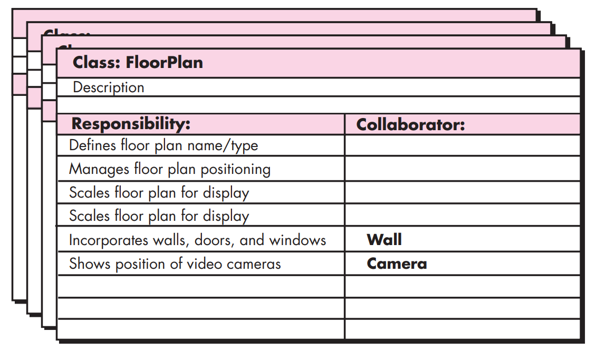
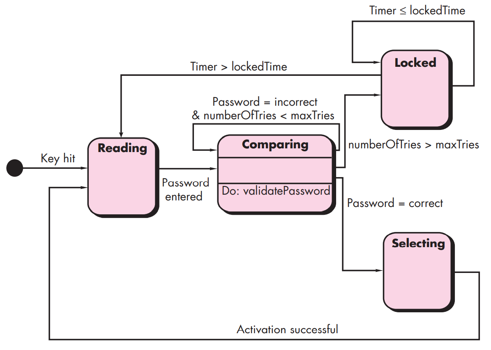

# Chap

## 01 Introduction to SE

### 1-1 软件的本质

### 1-2 WebAPP特征

### 1-3 SE Myths

（一些看起来很有道理实际上比较坑的话术）

- 管理神话（经理自我安慰）
- 客户神话（客户异想天开）
- Practitioner’s myths 

## 02 SE

- The application of a systematic, disciplined, quantifiable approach to the development, operation and maintenance of software.
- The study of approaches as in (1).

### 2-1 SE engineering layers

- tools
- methods
- process model
- a qualify focus

### 2-2 Generic Process Framework

- communication
- planning
- modeling
- construction
- deployment

## 03 Process Structure

Software processes can be constructed out of pre-existing software patterns to best meet the needs of a software project. 

### 3-1 generic过程模型

通用过程框架定义了五种框架活动：沟通、策划、建模、构建、部署

process flow：

- linear process flow
- iterative process flow：执行下一活动前重复之前的一个/多个活动
- evolutionary process flow：一个圈
- parallel process flow

## 04 Process Models

### 3-2 惯用过程模型

**~ Waterfall Model (classic life cycle)**

> 如果有信息未被覆盖或者发现了问题，那么最好 “返回”上一个阶段并进行适当的修改，项目开发进程从一个阶段“流动”到下一个阶段，这也是瀑布模型名称的由来 

- communication, planning, modeling, construction, deployment
- ==需求确定==、工作线性的时候很有用
- 实际项目很少可以这么顺序的操作
- 需要客户明确需求，但是客户通常难以描述所有需求
- 后期才会有效果，理想跟现实常常不一致
- 阻塞状态（后一个activity必须等待前一个）

**~ V-Model (瀑布模型的变体)**

> 提供了一种将<u>验证确认</u>动作应用于早期软件工程工作中的方法。

**~ Incremental Process Model**

> 把待开发的软件系统模块化，将每个模块作为一个增量组件，从而分批次地分析、设计、编码和测试 

- 需要迅速提供时可采用，综合线性过程流和并行过程流
- 与瀑布模型相比，不需要一次性将整个软件交给用户，可以==分批提交==，第一个增量往往是core product
- ==人员不足==
- Rapid Application Development (RAD) Model
    - ==require sufficient human resources==, 多个团队并行工作
    - require rapid-fire (both developers and customers)
    - 如果系统不能被模块化，RAD就不太行
    - tuning interface需要的话，RAD也不太行
    - 技术风险高的时候也不太行

**~ Evolutionary Process Models**

- Prototyping

    > 软件开发人员在与用户进行需求分析时，以比较小的代价快速建立一个能够反映用户主要需求的原型系统，然后由客户或者用户进行评价。开发人员根据反馈进一步对原型进行补充和完善，直到用户对开发的原型系统满意为止。 

    - 由用户进行评价
    - 第一个prototype必须被扔掉

- Spiral Model

    - ==风险驱动==型
    - 采用循环的方式逐步加深系统定义和实现的深度，同时降低风险（要求在项目的所有阶段始终考虑技术风险）
    - 确定一系列里程碑，确保共利益者都支持可行的和令人满意的系统解决方案
    - 适用于大型系统开发

**~ Concurrent Development Model (Concurrent Engineering)**

- 所有类型的软件开发都可用，especially good for client/server app
- 定义了一系列事件，这些事件将触发软件工程活动、动作或状态转换
- Define a network of activities instead of linear sequence of events 

### 3-3 专用过程模型

> 应用面较窄而专一

Component based development (CBD): REUSE

Formal methods: 生成计算机软件的数学规格说明 

Aspect-Oriented software development (AOSD): 

- provides a process and methodological approach for defining, specifying, designing, and constructing aspects 
- eg. Interface type

### ? 4-3 UP (Unified Process)

> 一种用UML进行面向对象软件工程的框架

Inception phase: 客户沟通和策划活动

- vision document
- prototype

Elaboration phase: 沟通和通用过程模型的建模活动（包括软件的五种视图：用例模型、需求模型、设计模型、实现模型和部署模型）

- use-case model
- revise risk list

Construction phase

- test plan
- test cases

Transition phase: 构建的后期阶段+交付和反馈

- beta test

Production phase: 监控软件的持续使用，提供运行环境的支持，提交并评估缺陷报告和变更请求

### 2-6 Personal & Team Process Models

## 05 Agile Development

### 3-4 XP & IXP

Framework activities in Extreme Programming (XP)

- planning
- design 
- coding (pair programming)
- testing

IXP (工业极限编程)：管理具有更大的包容性，扩大了用户角色，升级技术实践

### 3-5 其他敏捷过程模型

**ASD** 自适应软件开发（思考、协作、学习）

**Scrum** 每个工作任务称为sprint

- 上次例会后做了什么
- 下次例会前做什么
- 遇到了什么困难

**DSDM** 动态系统开发（80%的应用系统可以用20%的时间交付）

**Crystal**

**FDD** 特征驱动开发

**LSD** 精益软件开发（遵从承诺、快速交付、尊重成员、整体优化）

**AM** 敏捷模型

- Model with a purpose
- Use multiple models
- Travel light
- Content > representation
- Know the models and tools you use
- Adapt locally

**AUP** 敏捷统一过程

## 06 Human Aspects of SE

有多样性的队伍更加有效率

## 07 Principles that Guide Practice

Requirements models depict software in three domains 

- information
- function
- behaviour

The agile view of iterative customer communication and collaboration is applicable to **ALL** software engineering practice. 

## 08 Understanding Requirements

**Requirements Engineering**

1. Inception

    - basic understanding
    - who want
    - communication & collaboration

2. Elicitation (requirements from all stakeholders)

3. Elaboration: analysis model

4. Negotiation: deliver a realistic system

5. Specification

    - document

    - models

    - mathematical

    - use-cases

        

    - prototype

6. Validation

    - errors
    - missing information

7. Requirements management

**Quality Function Deployment** 质量功能部署三类需求

- normal requirements 客户的需求
- expected requirements 基础需求，如人机交互的容易性、运行正确性、可靠性、软件安装简易性
- exciting requirements客户期望之外的需求（鹅颈需求）

**Non-Functional Requirements**

- quality, performance, security

## 09-11 Requirements Modeling

### 9-1 Scenario-Based Methods

### 9-2 Class-Based Methods

Class diagram

CRC modeling

### 9-3 Behaviour Modeling

### 9-4 Flow-Oriented Modeling

# Flow chart

## Flow graph notation

## cyclomatic complexity

1. The number of regions of the flow graph corresponds to the cyclomatic complexity.
2. Cyclomatic complexity V(G) for a flow graph G is defined as V(G) = E - N + 2, where E is the number of flow graph edges and N is the number of flow graph nodes.
3. Cyclomatic complexity V(G) for a flow graph G is also defined as V(G) = P + 1, where P is the number of predicate nodes contained in the flow graph G.

# Cal

## LOC and FP Metrics

# 50分题

## Data flow diagram

[软件工程数据流图的画法-百度经验 (baidu.com)](https://jingyan.baidu.com/article/4f34706eefdb04e387b56deb.html)

**Level 1 DFD for SafeHome security function**

**A data flow model for SafeHome software**

## CRC

==注：并非每一责任点都要有对应协作类！==

**A CRC model index card**

## State Diagram

**State diagram for SafeHome security function**

**State diagram for the  ControlPanel class**

## Web-based software arch

## Testing strategy

Concept Testing, Component Testing (Unit Test),Content Testing, Interface Testing,
Navigation Testing; Integration Testing, Configuration Testing; Regression（回归）Testing;
Performance Testing, Security Testing, System Testing, …

注意：要针对题目实际，从小而大选出6-7种测试技术，不要全选名称而不做解释！

本题建议可选的测试技术有：

* **==Component Testing==** (Unit Test),测试每一个模块的功能是否完备（测试模块接口保证信息的出入、测试数据结构确保数据完整性、测试边界条件确保模块在临界状态仍能正常执行）
* **==Integration Testing==**,：测试不同模块合并成系统后是否还能正常工作，如数据是否会在模块间传输时丢失
* Performance Testing,：并发性、响应时间
* **==Security Testing==**,：测试系统的保护机制能否保护系统不受非法入侵。系统的权限管理是否完整，是否会被SQL注入，是否存在缓冲区溢出、字符串注入等运行时安全问题
* System Testing,：全系统测试
* Regression（回归）Testing，：检查修复bug之后其他功能是否受影响
* Content Testing,
* Interface Testing,
* Stress Testing：测试在非正常的极端条件（数量、频率、容量）下系统能否正常工作
* Deployment Testing：在要运行的每种OS中进行测试

# 其他

## Sequence diagram

**Sequence diagram (partial) for the SafeHome security function**

## UML sequence diagram

**UML sequence diagram for the Actuator-Sensor pattern. Source: Adapted from [Kon02] with permission**

## NSU

**Creating an NSU**

