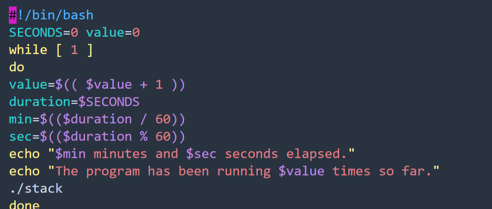

```c
# An safe use of `strncpy` instead of `srtcpy`
strncpy(dst, src, sizeof(dst) - 1);  // positively prevent the overwrite of the last char of dst
dst[sizeof(dst) - 1] = '\0';         // in case null being overwritten
```


**Call**

call将返回地址压栈，然后修改eip为函数的地址

```assembly
# i386里ebq是frame pointer

# 调用时的栈切换
push %ebp       # 存住上一个函数的栈底
mov %esp, %ebp  # 用上一个函数的栈顶作为当前的栈底

# `leave` macro
mov %ebp, %esp
pop %ebp

# `ret` macro
pop %eip        # cs:ip <-- return_addr
```


**Shellcode**

作为字符串进行overflow，不能含有\'\\0\'

其中


## Sol

### ASLR

这样每次恶意代码的位置都一样了，可以一定程度上增加安全性，但是BF还是很好破解



### Stack guard

在local var和ret value之间加一个stack guard (canary)，值是由编译器指定的，备份在另一个位置（Thread-Local Storage），运行时检查它的值，如果和备份不一样就说明栈被修改了，直接abort整个进程

* 无法解决data-only（没有修改控制流，而是通过修改某个重要变量影响了程序的运行）的情况
* 同样可以BF，每次fork一个子进程专门用于遍历canary的值，crash了就fork一个新的