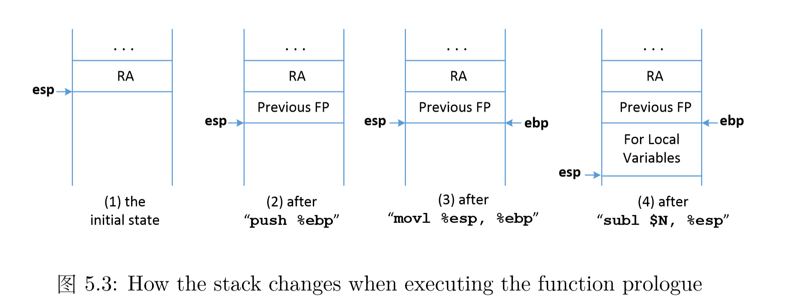
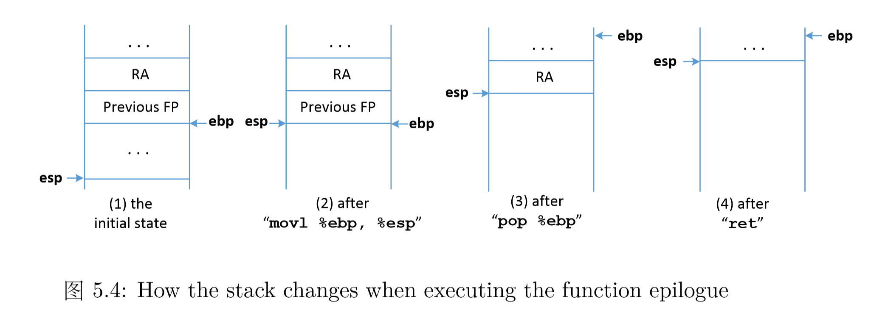
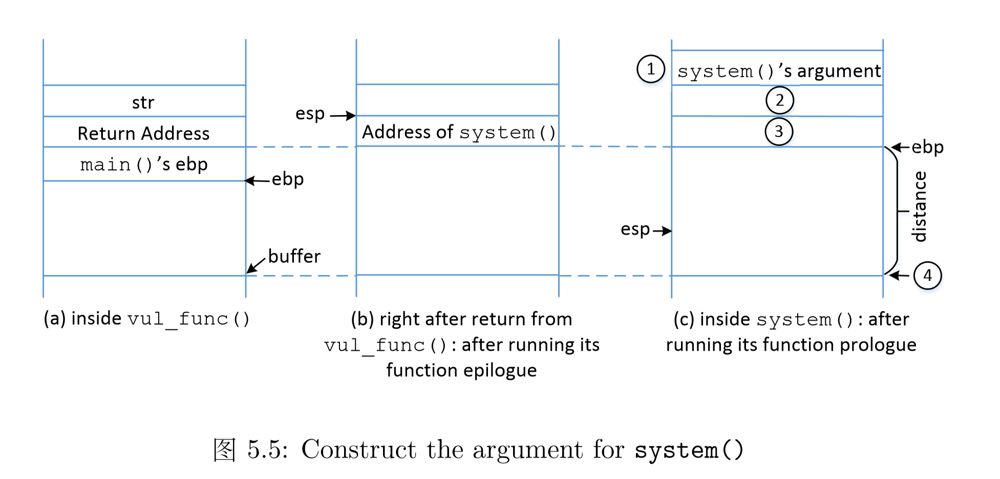
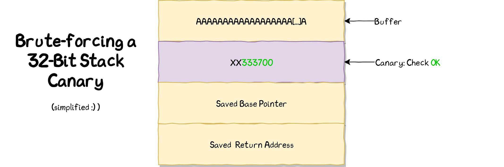

## Stack Layout





So when invoke system directly from vul_func():



本来esp应该在RA下面的（因为这是由caller的call指令完成的），但是此时由于是直接返回到system，所以esp跑到RA上面了

### Canary



## How to Attack

* Step I: find the address of system function
* Step II: find the string “/bin/sh”
* Step III: pass “/bin/sh” to system function

# ASLR on

## How to know the base addr of libc

We can abuse the data in the PLT to leak the library function

* Why? 因为存在于可执行文件中，所以位置是固定的

### GOT & PLT

**Global Offset Table**

* To be an indirection table and accessed when PIC calls functions and operates on data variables.
* It always consumes no space in executables and allocate memory when loading.
* The values in GOT will be evaluated at runtime by linker.


**Procedure Linkage Table**

* For procedure only.
* To support dynamic linking, each ELF shared libraries or executables that uses shared libraries has a PLT.
* Adds a level of indirection for function calls analogous to that provided by the GOT for data


[Linux动态链接为什么要用PLT和GOT表？ - 海枫的回答 - 知乎](https://www.zhihu.com/question/21249496/answer/126600437)


## Gadget

```assembly
# i386里ebq是frame pointer

# 调用时的栈切换
push %ebp       # 存住上一个函数的栈底
mov %esp, %ebp  # 用上一个函数的栈顶作为当前的栈底

# `leave` macro
mov %ebp, %esp
pop %ebp

# `ret` macro
pop %eip        # cs:ip <-- return_addr
```

