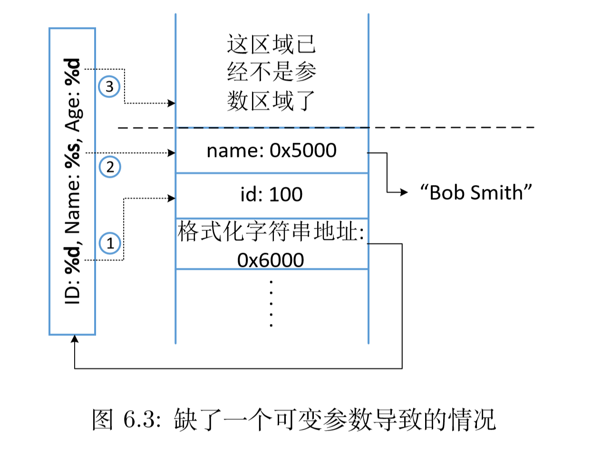
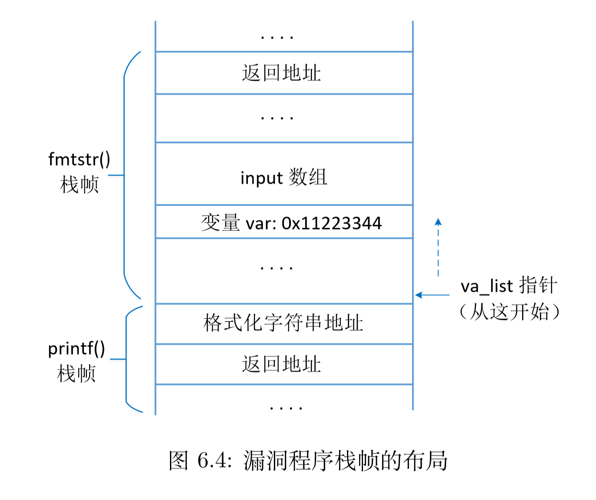

## Optional Arguments

### example def

```c
/*
    va_start, va_arg, va_end
*/

#include <stdarg.h>
#include <stdio.h>

int myprint(int Narg, ...) {
    int i;
    va_list ap;
    
    va_start(ap, Narg);
    for (i = 0; i < Narg; i++) {
        printf("%d\t", va_arg(ap, int));
        printf("%f\n", va_arg(ap, double));
    }
    va_end(ap);
}
```

### init va_list (va_start)

call `myprint(2, 2, 3.5, 3, 4.5)`

```
|              |
+--------------+
| (double) 4.5 |
+--------------+
|    (int)3    |
+--------------+
| (double) 3.5 |
+--------------+
|    (int)2    |
+--------------+
| (int)Narg: 2 |
+--------------+
|              |
```

`void va_start(va_list ap, last)` 

Try [man stdarg](> main stdarg)

va_start()

The va_start() macro initializes ap for subsequent use by va_arg() and va_end(), and must be called first.

The argument last is the name of <u>the last argument before the variable argument list</u>, that is, the last argument of which the calling function knows the type.<!--在这里就是...前的最后一个参数Narg-->

Because the address of this argument may be used in the va_start() macro, it should not be declared as a register variable, or as a function or an array type.h

### move va_list (va_arg)

va_arg()

The va_arg() macro expands to an expression that has the type and value of the next argument in the call. The argument ap is the va_list ap initialized by va_start(). Each call to va_arg() modifies ap so that the next call returns the next argument. The argument type is a type name specified so that the type of a pointer to an object that has the specified type can be obtained simply by adding a * to type.

The first use of the va_arg() macro after that of the va_start() macro <u>returns the argument after last</u>. Successive invocations return the values of the remaining arguments.

If there is no next argument, or if type is not compatible with the type of the actual next argument (as promoted according to the default argument promotions), random errors will occur.

If ap is passed to a function that uses va_arg(ap,type), then the value of ap is undefined after the return of that function.

### clean up va_list (va_end)

## printf

如果格式化参数比可变参数多：`printf("ID: %d, Name: %s, Age: %d", id, name)`



## A vul example

```c
#include <stdio.h>

void fmtstr() {
    char input[100];
    int var = 0x11223344;

    printf("Target addr: %lx\n", (unsigned long)&var);
    printf("Data at target addr: 0x%x\n", (unsigned)var);

    printf("Please enter a string: ");
    fgets(input, sizeof(input) - 1, stdin);

    printf(input);

    printf("Data at target addr: 0x%x\n", (unsigned)var);
}

int main() {
    fmtstr();
}
```



### Attack1

当输入"%s%s%s"（三个及以上）时就会crack，因为把RA给改了

### Attack2

We need to calculate the offset between secret and va_list: The fifth %x