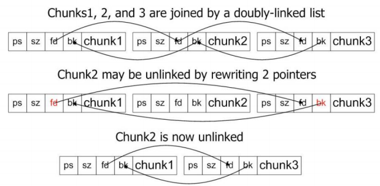

# Int Overflow

用于破坏heap：

```c
int main(int argc, char *const *argv) {
    unsigned short total;
    total = strlen(argv[1]) + strlen(argv[2]) + 1;  // int overflow
    char *buff = (char *)malloc(total);
    strcpy(buff, argv[1]);  // heap overflow
    strcat(buff, argv[2]);
}
```


用于破坏index：

```c
int *tables = NULL;
int insert_in_table(int pos, int value) {
    if (!table) {
        table = (int *)malloc(sizeof(int) * 100);
    }
    if (pos > 99) {
        return -1;
    }
    table[pos] = value;  // pos may be negative
    return 0;
}
```

# Heap Overflow

## Heap Allocator

* Heap allocators (AKA memory managers)
    * What regions have been allocated and their sizes
    * What regions are available for allocation
* Heap allocators maintain metadata such as chunk size, previous, and next pointers
    * Metadata adjusted during heap management functions
        * malloc() and free()
    * Heap metadata often inlined with heap data

Example of removing a chunk: 

## Attack