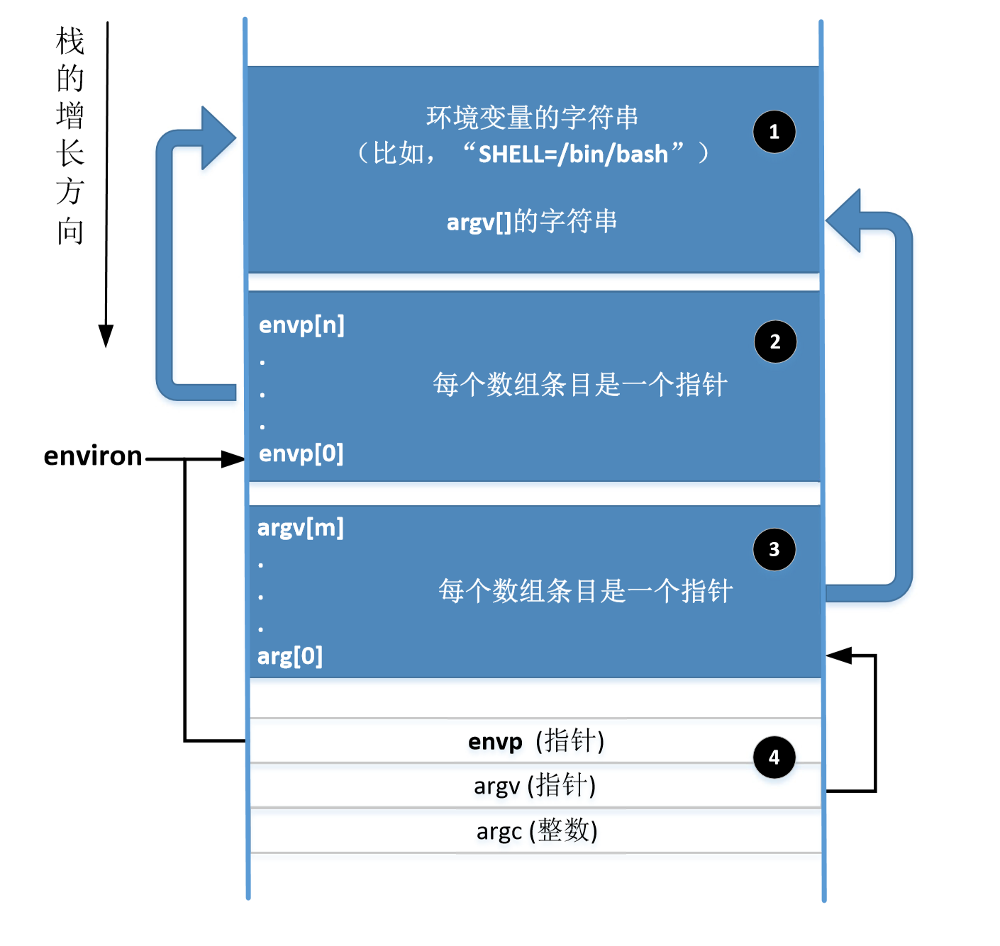
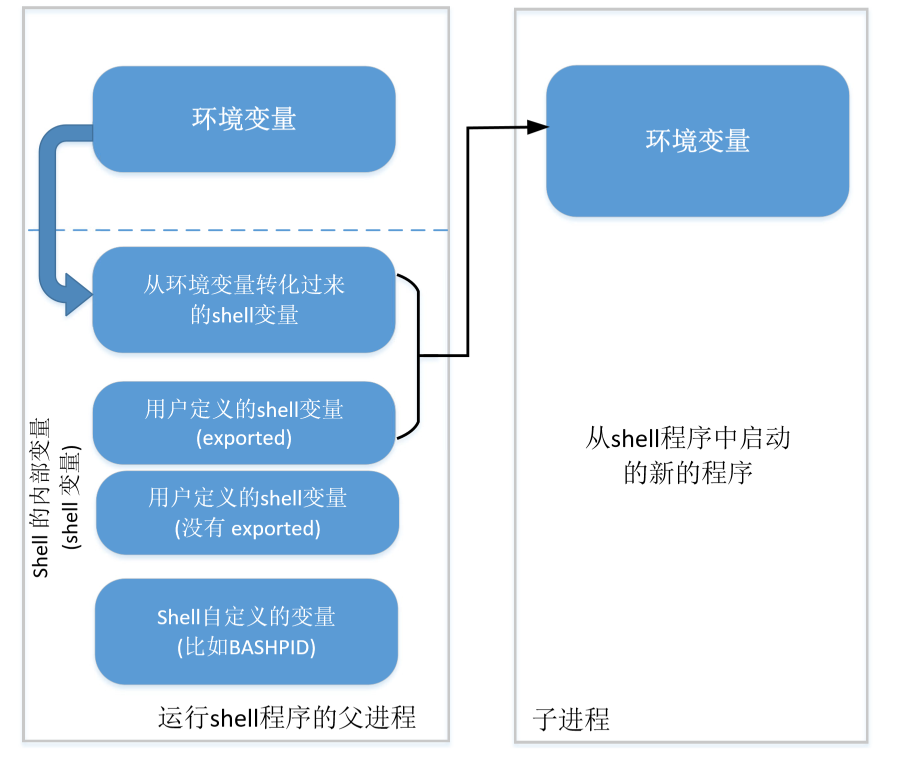
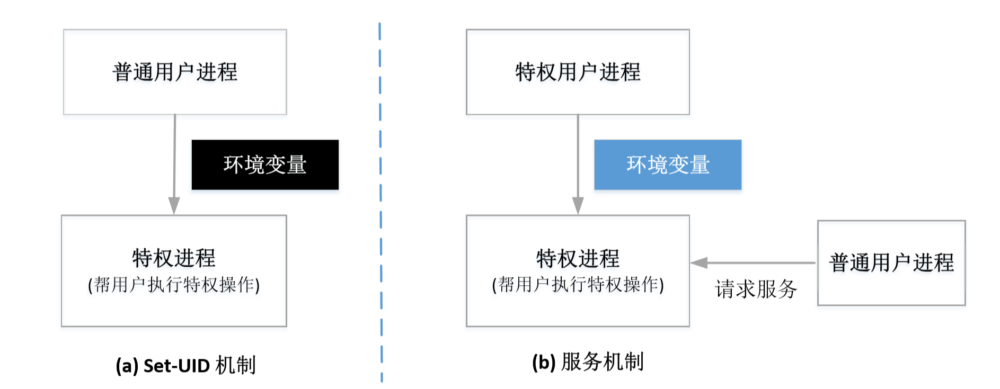

# Set UID

## Type of UID

Real user ID, effective user ID, saved user ID

* Real user ID: the real owner of the process
* Effective user ID: the ID used for access control

## Principle

* 对于文件权限的检查仅在打开后进行 
* 如果打开一个文件后meo关闭，那fd就一直有效
* 如果用有权限的uid打开后获得了fd，其他无权限用户也可以用这个fd进行操作

# Env Var

## About Env Var

```c
int main(int argc, char *argv[], char *envp[]);
int execve(const char *filename, char *const argv[], char *const envp[]);
```

```c
#include <unistd.h>

extern char **environ;
void main(int argc, char *argv[], char *envp[]) {

    if (argc < 2)
        return;

    char *v[2]      = {"/usr/bin/env", NULL};
    char *newenv[3] = {"AAA=aaa", "BBB=bbb", NULL};

    switch (*argv[1]) {
        case '1':  // Pass no env var
            execve(v[0], v, NULL);  // filename = '/usr/bin/env'; argv = {'/usr/bin/env', NULL}
            break;
        case '2':  // Pass a set of new env var
            execve(v[0], v, newenv);
            break;
        case '3':  // Pass all env var
            execve(v[0], v, environ);
            break;

        default: break;
    }
}
/* Output
# ulysses @ JVAIOSX12 in /mnt/c/Users/Ulysses/Code/vscode_test [10:42:44] 
$ bin/a.c.out 1

# ulysses @ JVAIOSX12 in /mnt/c/Users/Ulysses/Code/vscode_test [10:43:01] 
$ bin/a.c.out 2
AAA=aaa
BBB = bbb


# ulysses @ JVAIOSX12 in /mnt/c/Users/Ulysses/Code/vscode_test [10:43:02] 
$ bin/a.c.out 3
USER=ulysses
WT_PROFILE_ID={c6eaf9f4-32a7-5fdc-b5cf-066e8a4b1e40}
SHLVL=2
HOME=/home/ulysses
OLDPWD=/mnt/c/Users/Ulysses/Code/vscode_test
WSL_DISTRO_NAME=Ubuntu-18.04
LOGNAME=ulysses
WSL_INTEROP=/run/WSL/68_interop
NAME=Code
_=/mnt/c/Users/Ulysses/Code/vscode_test/bin/a.c.out
......
*/
```

## Mem Loc



What if we add many environments that the memory *space is not enough*?

* Move environments to other place heap
* environ will be updated
* ==envp will not change==

## Shell Var and Env Var

**Shell variables**: internal variables maintained by a shell program

* When a shell starts, for each env variable, it creates a shell variable with the same name


* Shell variables affect the environment variables of child process
* When bash executes a new command
    * Fork() and execve
    * It compiles an array of name value pairs from its shell variables and set the third argument ( envp ) of execve () using this array
    * TYPE I: shell variable copied from environment variables.
        * if the shell variable is detected using unset, it will not appear
    * TYPE II: user defined shell variables marked for export



## Attack

### Dynamic Linker

修改`LD_PRELOAD/LD_LIBRARY_PATH`

但是对于set-UID程序这种方法不可行：Ld-linux.so will ignore `LD_PRELOADED` if <u>real UID is different from effective UID</u>

### External Prog

Two ways to execute external program: system() and execve()

？？？？

### App Code

change PWD

```zsh
# ulysses @ JVAIOSX12 in /mnt/c/Windows/System32 [11:23:14]
$ pwd
/mnt/c/Windows/System32

# ulysses @ JVAIOSX12 in /mnt/c/Windows/System32 [11:23:22]
$ echo $PWD
/mnt/c/Windows/System32


# ulysses @ JVAIOSX12 in /mnt/c/Windows/System32 [11:23:25]
$ PWD=lktp

# ulysses @ JVAIOSX12 in /mnt/c/Windows/System32 [11:23:37]
$ pwd
/mnt/c/Windows/System32

# ulysses @ JVAIOSX12 in /mnt/c/Windows/System32 [11:23:41]
$ echo $PWD
lktp


# ulysses @ JVAIOSX12 in /mnt/c/Windows/System32 [11:23:48]
$ export PWD="Whatever"

# ulysses @ JVAIOSX12 in /mnt/c/Windows/System32 [11:24:47]
$ pwd
/mnt/c/Windows/System32

# ulysses @ JVAIOSX12 in /mnt/c/Windows/System32 [11:24:51]
$ echo $PWD
Whatever

# ulysses @ JVAIOSX12 in /mnt/c/Windows/System32 [11:24:59]
$ ./prog  # this is a program which `printf("%s", getenv("PWD"))`
Whatever
```

## Set-UID & Service



# Shell Shock

```bash
$ foo='() { echo "Hello world"; }; echo "extra";'
$ echo $foo
() { echo "Hello world"; }; echo "extra";
$ export foo
$ bash_with_shellshock
extra
(child):$ echo $foo

(child):$ declare -f foo
foo ()
{
    echo "Hello world"
}
```

