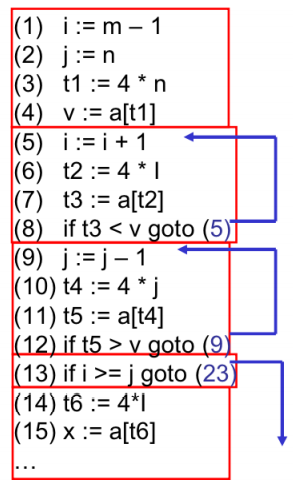
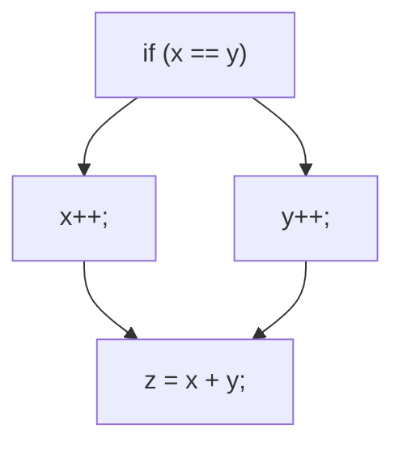
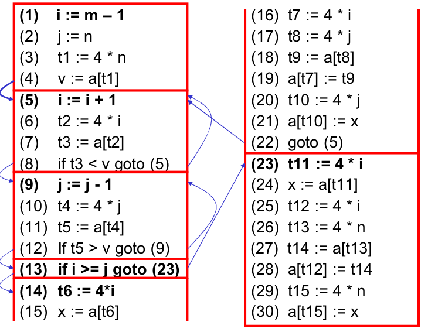

# Program Analysis

Program Analysis is broadly classified into

* Dynamic analysis
* Static analysis

## Dynamic Analysis

* Major advantage
    * After detecting a bug, it is a real one
        * No false positives
* Major limitation
    * Detecting a bug for a particular input - coverage
        * Cannot find bugs for uncovered inputs
        * `If (input == 0x134576) {bug()} else {normal();}`
        * low-speed

## Static Analysis

利用中间编译信息去找可能存在的bug

问题：Can identify many false positives (not actual bugs)

### Some methods

* simple syntactic checks like `grep`
    * `grep " gets(" *.cpp`
        * consider gets, strcpy, strcat, ... as unsafe
* dataflow analysis, abstract interpretation, symbolic execution, constraint solving, model checking

# Control Flow Aanlysis

## Basic Block

**Definition**

* A basic block is a maximal sequence of consecutive statements with a <u>single entry point, single exit point</u> and <u>no internal branches</u>



**Identify**

* Determine the leaders, the first statements of basic blocks
    * The first statement in the sequence (entry point) is a leader
    * Any statement that is the target of a branch (conditional or unconditional) is a leader
    * Any statement immediately following a branch (conditional or unconditional) or a return is a leader
* For each leader, its basic block is the leader and all statements up to, but not including, the next leader or the end of the program

## CFG

G = (N, E) as a directed graph

* Node n ∈ N: basic blocks
* Edge e=(ni, nj) ∈ E: possible transfer of control from block ni to block nj

```c
if (x == y) {
    x++;
} else {
    y++;
}
z = x + y;
```



### Generating CFG



### Traversal

### Dominance

* Node d of a CFG dominates node n if <u>**every** path from the entry node of the graph to n passes through d (d dom n)</u>
    * Dom(n): the set of dominators of node n
    * Every node dominates itself: n ∈ Dom(n)
    * Node d strictly dominates n if d ∈ Dom(n) and d ≠n
    * Dominance-based loop recognition: entry of a loop dominates all nodes  in the loop
* Each node n has a unique immediate dominator m which is the last dominator of n on any path from the entry to n (m idom n), m≠n
* The immediate dominator m of n is the strict dominator of n that is closest to n